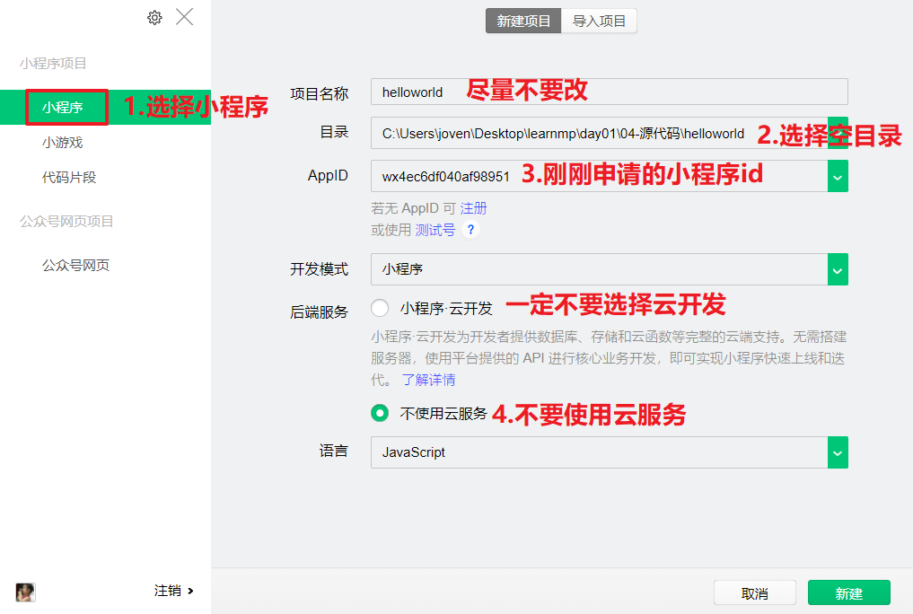
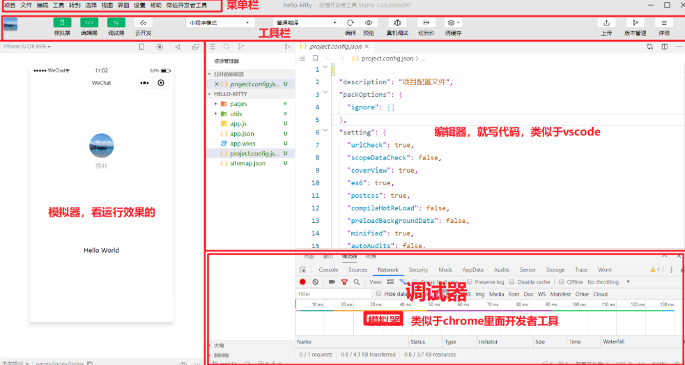
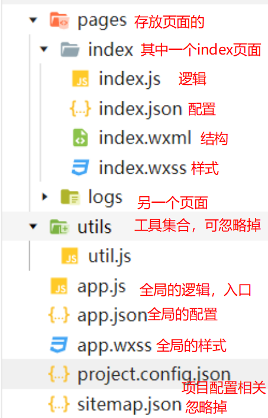

## day01 - 小程序

### 复习

+ html + css
+ js + jq
+ ajax + 模板引擎
+ nodejs
+ vue
  + 70%
+ 小程序
  + 30%
+ react
  + 现状：岗位多，人才少


### 今日内容

略


### 问题 - 小程序重要吗

> 答案：重要，非常重要

+ 从课程安排上来看
  + 44期之前小程序课程在react之后
  + react课程大大缩短，小程序逐渐加长

+ 从学生就业工作内容上看（从端上来分）
  + pc端

    + 官网
      + 趋向于简单的介绍
      + 开发量少
    + 后台管理系统
      + 业务量大的
        + 举例，黑马面面
      + 学生就业最多的方向

  + 移动端

    + App

      + 混合模式的App
      + 开发难度比较高，对自己成长更好

    + H5(运行在浏览器中网页)

      + 举例：黑马面面移动端

      + 也应该包括微信公众账号的开发也是网页

    + 微信小程序

      + 基本上用作引流

      + 如果开发移动端，基本上都需要会微信小程序


### 问题 - 小程序难吗

> 如果你学好了， vue 那么你学习小程序会非常容易

+ 思路和Vue一样，语法也是类Vue, 语法需要记忆


### 问题 - 课程的安排

+ 基本语法 - 2天
+ 优购商城 - 8天
  + 使用 uniapp 完成代码的开发
    + uniapp 特点：一套代码可以生成多端执行的代码：
      + h5 & 小程序 & app
    + 商城是所有小程序中业务类型最多的一种
  + [uniapp 传送门](https://cloud.tencent.com/act/weapp)


### 基础 - 小程序开发流程

> 流程来自于官网：https://mp.weixin.qq.com/cgi-bin/wx?token=&lang=zh_CN

步骤：

+ 准备工作
  + 注册帐号
  + 完善信息
+ 开发小程序
  + 安装微信开发者工具：https://developers.weixin.qq.com/miniprogram/dev/devtools/devtools.html
  + 熟悉小程序开发文档：https://developers.weixin.qq.com/miniprogram/dev/framework/
+ 发布小程序
  + 审核
  + 发布


### 准备工作 - 注册帐号

> https://mp.weixin.qq.com/wxopen/waregister?action=step1

步骤：

+ 1.0 填写账号信息

  + 邮箱不能是注册过订阅号和服务号，也不能被个人微信绑定
  + 如果提示被占用，重新注册一下

  

+ 2.0 邮箱激活

  

+ 3.0 信息登记

  + 学习阶段使用**个人类型**的就行，其他类型需要认证

  + 填写真实的姓名，身份证号码，手机号码

  + 微信扫码后，该**微信账号就是小程序的管理员**

    

+ 4.0 小程序信息完善

  + 小程序名字尽量取不重复的
  + 头像尽量正常
  + 服务类目尽量选择"**工具-信息查询**"，审核最快

  


+ 5.0 找到你的AppID

  + 开发-开发设置-找到appid

  

**总结**：

+ 1.0 填写账号信息
  + 邮箱 & 密码
+ 2.0 邮箱验证
+ 3.0 完善个人信息
  + 帐号：类别
  + 个人信息：姓名 & 身份证 & 手机号 & 微信
+ 4.0 完善小程序信息
  + 服务类目：工具 -> 信息查询
+ 5.0 找到自己小程序的身份证号：APPID
  + 开发 -> 开发设置

+ 以上5步做完成之后，帐号已经注册成功：以后可以直接登录：
  + https://mp.weixin.qq.com/


### 开发小程序 - 安装微信开发者工具及使用

> 工具下载地址：https://developers.weixin.qq.com/miniprogram/dev/devtools/devtools.html

**步骤：**

+ 1.0 下载安装微信开发者工具（稳定版）

+ 2.0 创建helloworld项目

  

+ 3.0 预览项目
  
  + 微信开发者工具 -> 预览，然后手机扫码

**注意点：**

+ 开发相关工具，默认安装路径才是最稳定的
  
+ 新建时选择空目录，比如说空目录是"c:/helloworld"，那么你的项目就在“c:/helloworld”
  
+ 可能需要你手动创建一个空文件夹

+ 一定要不选择云服务，不然生成的目录结构不一样

+ 微信开发者工具AppId可以填三种
  + 真实的，微信开发者工具所有的菜单栏都可以用
  + 测试号，微信开发者工具不能上传
  + appid格式填错了，微信开发者工具，不能预览也不能真机调试，也不能上传

+ 修改appid

  


### 开发小程序 - 熟悉开发者工具

> 工具介绍：https://developers.weixin.qq.com/miniprogram/dev/devtools/page.html#%E5%90%AF%E5%8A%A8%E9%A1%B5



**组成**：

+ 菜单栏
  + 新建项目

  + 导入项目，打开已有项目。在微信开发者工具里面，不能拖入打开

  + 打开最近的项目，会展示一个最近项目列表，点击即可打开

  + 设置-外观 可以设置深色模式

  + 设置->编辑

    

+ 工具栏
  + 编辑器，模拟器，调试器，点击是否显示对应模块，当然最少得显示一个

  + 编译：手动编译

  + 预览：点击出现二维码，手机扫码，就可以在手机微信里面查看效果

  + 自动预览，自动刷新手机上预览效果

    + 模拟器就是用来查看效果

      + 切换机型

      + 显示比例

+ 编辑器
  + 相当于是vscode, 快捷键和vscode完全一致
  + 左侧是项目结构，右侧是编辑文件
  + 有git功能，好用

+ 调试器
  + wxml是结构
  + console是打印
  + sources查看源码，方便打断点调试
  + network查看请求
  + storage存储
  + 终端和vscode一致
  
+ 模拟器


### 开发小程序 - 熟悉小程序开发文档

> 文档传送门：https://developers.weixin.qq.com/miniprogram/dev/framework/

**社区：**

> 谈论分享研究小程序的相关技术

+ 微信开发者工具，帮助-小程序社区

文档：

+ 微信开发者工具，帮助->开发者文档

+ 重点介绍小程序文档
  + 组件：当你需要了一个结构时，找组件
  + API：当你需要逻辑或者方法时，找API
  + 如果想找小程序原理相关，在指南和框架里面找


### 开发小程序 - 小程序项目结构

> 静态页面的结成：
>
> > html：结构
> >
> > css：样式
> >
> > js：行为



+ 页面全部存放在pages, 而且pages目录只能存放页面
  + 页面包括4个文件，`pages/页面名/页面名.js(wxss,json,wxml)`

    + 4个文件的文件名必须一致

    + 4个文件
      + .js 页面逻辑
      + .json 页面配置
      + .wxml 页面结构
      + .wxss 页面样式

+ app.js 是小程序入口文件，先忽略掉

+ app.json
  + pages配置的数组，是有序的。第一个就是模拟器显示的页面

    ```json
    {
    	// 所有的页面路径都应该配置在这个数组里面，如果没有配置，如果跳转
      "pages":[
        "pages/index/index",
        "pages/logs/logs"
      ],
        //全局窗口样样式
      "window":{
        "backgroundTextStyle":"light",
          //导航栏方案的背景色
        "navigationBarBackgroundColor": "#fff",
          //导航栏的文案
        "navigationBarTitleText": "等你回家",
                //导航栏方案的前景色
        "navigationBarTextStyle":"black"
      }
    }
    ```

+ app.wxss 全局样式

 

### 开发小程序 -  基本标签的使用

> html 中开发页面主要使用标题，小程序中开发页面主要使用组件：https://developers.weixin.qq.com/miniprogram/dev/component/


**准备工作**

+ 1.0 在 pages 中添加一个文件夹： `mydemo`
+ 2.0 在 `mydemo` 文件中创建一个  `pages`
  + 自动生成 page 所需的四个文件
  + 自动将 `mydemo` 添加到 app.json 中的 `page` 属性
  + 如果要打开页面就访问 `mydemo`
    + 只需要将 `mydemo` 路由放到 `page` 属性的最前面

**将小程序中的组件名当标签使用即可**

> 组成小程序页面的并不是 html 标签，而是小程序中的组件

+ text 显示文本的

  + 相当于是span标签，是行内元素

+ view 包裹作用

  + 相当于是div

+ image 就是显示图片

  + 默认的高度和宽度

  + 实际开发时，需要设置高度和宽度

+ button 按钮

  + size:mini表示小的按钮

    ```html
    <button>默认的按钮</button>
    <button size="mini">小按钮</button>
    ```

    

**注意点：**

+ 新建页面
  + 在pages.json添加路径，并放在第一个

+ 小程序里面不认识的标签，会忽略标签，基本上和text一样，尽量不要使用非小程序组件的标签


### 练习 - 图文混排案例


**思路：**

1. 先新建页面goods
2. 先结构后样式


### 语法 - 数据绑定

> 小程序与 vue 一样，也可以用指令来操作 dom：https://developers.weixin.qq.com/miniprogram/dev/reference/wxml/data.html

**语法：{{}}**

> 数据绑定使用 Mustache 语法（双大括号）将变量包起来 

1. 文本渲染

   ```html
   <!-- 文本渲染，使用{{}} -->
   <text>{{msg}}</text>
   ```

2. 属性绑定

   ```html
   <!-- 属性绑定,{{}} -->
   <image src="{{imgUrl}}"></image>
   ```

3. 条件判断

   1. wx:if和wx:else是固定写法，不能改
   2. 条件满足就渲染，如果不满足不移除dom

   ```html
   <!-- 条件判断{{}}
   如果条件满足就展示对应的dom -->
   <view wx:if="{{isHandsome}}">很帅</view>
   <view wx:else>丑B</view>
   ```

4. 列表渲染

   1. wx:for 是固定写法
   2. 默认的元素别名item，索引别名index
   3. wx:for-item可以指定元素别名
   
   ```html
   <!-- 遍历,{{}}
   默认的元素别名item,默认的索引别名index -->
   <view wx:for="{{movieList}}">{{item}}--{{index}}</view>
   ```
   
   

**注意点：**

+ 可以在微信开发者工具，调试器可以看到当前页面的data属性，也可以改

  

+ {{}}可以写表达式

  ```html
  <view class="box {{isRed?'red':''}}"></view>
  ```

  


### 语法 - 注册事件及消息提示框

>  小程序也可以给元素：
>
>  > 注册事件：https://developers.weixin.qq.com/miniprogram/dev/framework/view/wxml/event.html
>  >
>  > 显示提示框：https://developers.weixin.qq.com/miniprogram/dev/api/ui/interaction/wx.showToast.html

**注册事件**

+ 在结构中注册事件

  + 事件名有很多，但是最基本是tap事件

    > PC 端使用 click 事件，移动端用 top 事件

    ```html
    <button bind事件名="事件处理方法">点我呀</button>
    ```

+ 事件处理方法声明在和data平级

  ```js
  Page({
  	事件处理方法(){
          
      }
  })
  ```

  

**消息提示**

```js
wx.showToast({
    title: '点疼我了',  //提示的文案
    // icon:'loading'
    icon:'none', //提示框图标
    duration:3000,//提示时长
    mask:true //是否显示遮罩
})
```


**注意点：**

+ 小程序里面，大多数API是由"wx"对象提供的
+ "wx" 相当于是 vue 中的 this 对象


### this - 方法中的this

> 小程序中的 this 指向就的当前小程序页面实例，可以通过 this 取得对象上的属性与方法

**问题**：

+ 需求：有一个圆圈，点击圆圈时，切换背景色红色/白色
+ 思路：点击时改data属性，data属性渲染背景色红色/白色


**注意点**

+ 方法访问data属性 `this.data.属性名`

+ 方法访问方法 `this.方法名`

+ 改变data属性 `this.setData({属性名:值})`


### 练习 - 图片切换


### 语法 - 模块化

> 小程序中也支持模块化的概念：[传送门](http://es6.ruanyifeng.com/#docs/module) 

**作用**：

+ 把一些公共的代码抽离为作为一个单独js

**使用**:

+ 直接使用ES6的模块化
  
+ 传送门：https://es6.ruanyifeng.com/#docs/module
  
+ 使用方法
  + 在模块js中暴露方法属性或者对象

    ```js
    // 对外暴露
    export default sayHello
    ```

  + 需要使用模块的js里面引入

    ```js
    // 引入模块
    import sayHello from '../../utils/hello'
    ```

**注意点**

+ import路径**不支持绝对路径**，所以写相对路径即可

 

### 作业

+ 克鲁塞德战记
  
