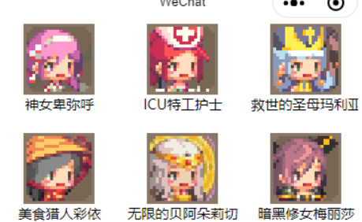
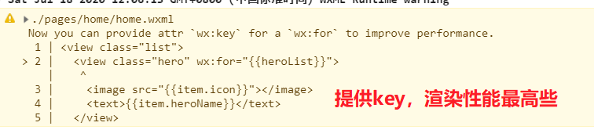
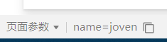
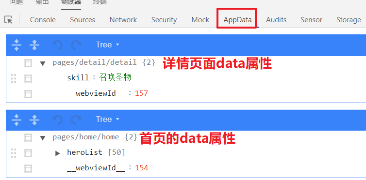
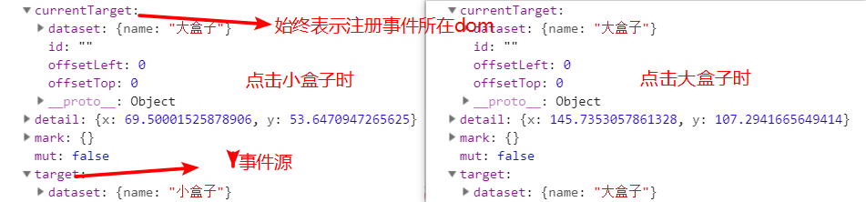
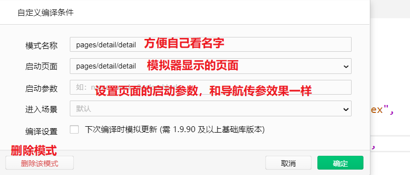
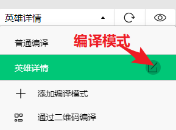
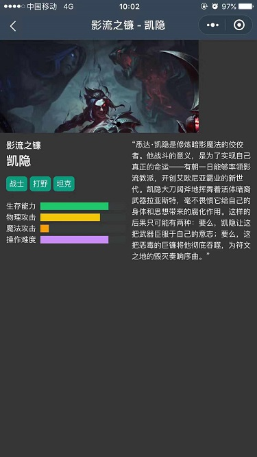
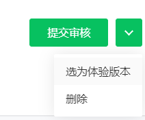
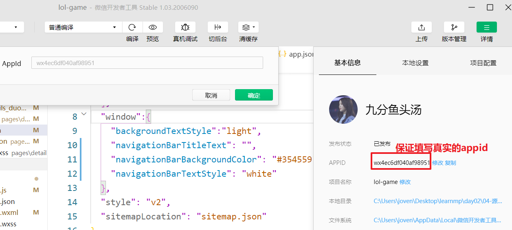

## day02

### 复习 

问题：

+ 小程序重要吗？
  + 重要，将来出去工作技术点主要是两块：vue & 小程序
+ 小程序难吗？
  + 不难，因为它的语法与 vue 非常相似
+ 课程安排：
  + 10天： 2天基础 8天的项目

开发流程：

+ 注册帐号 
+ 完善帐号信息
  + 个人信息
  + 帐号信息
+ 开发小程序
+ 发布&上线小程序

安装微信开发者工具

+ 菜单栏 & 工具栏 & 模拟器 & 调试器 & 编译器

开发文档

+ 百度 -> 搜索 ‘微信公众平台’ -> 小程序/文档

项目结构

+ page
  + .js  逻辑代码
  + .json 页面的配置
  + .wxml 页面的结构
  + .wxss 页面的样式
+ App.js 项目的入口
+ App.json 项目的配置文件
+ App.wxss 项目的全局样式

基本标签的使用

+ 小程序中不使用 html 中的标签，而是 使用它自己的组件来完成页面的结构

数据绑定：

+ {{  }}

显示与隐藏：

+ wx:if

遍历数据：

+ wx:for

事件的注册：

```json
<view bindtap="fn">绑定事件</view>
```

消息的提示框

```js
wx.showToast({
	title: '',
	icon: '',
	duration: 2000
})
```

使用 data 中的数据：

+ 使用： this.data.xx
+ 修改： this.setData({ xx: value })

模块化：

+ 一个 js 文件是一个单独的模块
+ 特点：
  + 导出： 
    + export default xx
  + 导入：
    + import xx from 'xx.js'


### 今日内容

案例：

+ 克鲁塞德战记
+ 英雄联盟案例


### 回顾 - ES6模块化

 **概念：**

+ 一个模块就是一个独立的文件。

**如何使用：**

+ export default

  ```js
  let firstName = 'Michael';
  
  export default firstName
  ```

+ import

  ```js
  import name from '../../utils/profile
  ```


**补充：**

+ 目前我们已经学习了两种模块化：
  + nodejs 中的模块化
    + 导出： module.export = xx
    + 导入：const xx  = require('xx.js')
  + ES6 中的模块化
    + 导出： export default xx
    + 导入： import xx from 'xx'

**注意点：**

+ 该文件内部的所有变量，外部无法获取。如果你希望外部能够读取模块内部的某个变量，就必须使用`export`关键字输出该变量

+ `export default`对外输出指定模块

+ `import`加载（导入）模块


### 练习 - 克鲁塞德战记

+ 作业内容，克鲁塞德战记



+ 先结构后样式

+ 逻辑
  + 导入数据
  + 引入数据，作为data属性，然后wx:for列表渲染


### 语法 - wx:key的设置(了解)



**表现：**

+ 如果不设置wx:for的key值，会报警告，警告提示：添加key提升性能

**添加：**

```html
<!-- 如果wx:for遍历数组的每一项是对象的话，那么wx:key设置元素一个属性名，要求属性对应的值是唯一的 -->
<view wx:for="{{objectArray}}" wx:key="id">
{{item.unique}}
</view>

<!-- 
  如果wx:for遍历数组，每一项不是对象的话，如果想给wx:key唯一标识，wx:key="*this" （等同于 :key="index"）
  相当于vue :key="item"
 -->
<view wx:for="{{numberArray}}" wx:key="*this">  
{{item}}
</view>
```

**注意点**

+ wx:for里面如果不提供wx:key, 有警告

+ wx:key设置是一个属性名，并不是一个值，而且没必要给{{}}


### 组件 - 轮播图组件

> 微信小程序里面除了基本的组件之外，还包括丰富组件库，有轮播图组件，横向滚动，进度条，富文本等等组件。。。
>
> 轮播图：[传送门](https://developers.weixin.qq.com/miniprogram/dev/component/swiper.html)

**使用组件**

+ 找到示例代码，先运行起来

+ 根据你的需求，添加相应属性即可

```html
<!-- 
indicator-dots	是否显示指示点
indicator-color 未激活的指示点的颜色
indicator-active-color 选中的指示点的颜色
autoplay 自动切换
interval 切换的间隔时间
duration 切换动画时长
circular 无限轮播
 -->
<swiper indicator-dots indicator-color="rgba(255,255,255,0.5)" indicator-active-color="#fff" autoplay interval="3000" duration="100" circular>
	<!-- block可以放wx:for，包裹作用，最终并不会渲染的 -->
	<block wx:for="{{4}}" wx:key="*this">
		<swiper-item>
			<image src="http://p3.music.126.net/2MsstS-M9w5-li0aRy3sUQ==/1380986606815861.jpg?param=200y200"></image>
		</swiper-item>
	</block>
</swiper>
```

**注意点：**

+ 如果属性是boolean类型，只有属性没有值的，值就为true. 这个是w3c规范。


### 组件 - navigator

>  navigator: [传送门](https://developers.weixin.qq.com/miniprogram/dev/component/navigator.html)

**作用：**

+ 跳转到其他页面

+ 类似于html  中的 a 标签 

**用法：**

+ 在结构中声明跳转页面，可以传参

  ```html
  <!-- url后面是跳转的路径，推荐使用绝对路径,“/”+ app.json找到你要跳转的页面路径 -->
  <navigator url="/pages/index/index?参数名1=值&参数名2=值">跳转到首页</navigator>
  ```

  

+ 目标页面上获取传参

  ```js
  Page({
  	// 相当于 vue 中生命周期钩子函数中的： created
      onLoad(options){
          console.log(options.参数名1) //可以获取到参数名1对应的值
      }
  })
  ```

**注意点：**

+ navigator url可以传相对路径或者绝对路径，推荐使用绝对路径。要以"'/', 路径最后没有扩展名`/pages/index/index.wxml`是错误的

+ 在模拟器页面参数这个位置，可以看到跳转传参，方便调试




### 练习 - 克鲁赛德战记案例-详情页


**需求：**

+ 点击列表其中一个英雄时，跳转到英雄详情页，显示该英雄的技能

**步骤：**

+ 新建一个detail页面

+ 点击英雄（包括图片和英雄名字）时，跳转到详情页
  
+ navigator组件包裹英雄，url为详情页
  
+ 跳转详情页，并传递skill参数

  ```html
  <navigator class="hero" wx:for="{{heroList}}" url="/pages/detail/detail?skill={{item.skill}}" wx:key="heroName">
  ```

+ 在detail页面上获取传参
  
  + onLoad
  + 渲染技能 
  
    + options.skill设置到data属性，然后渲染

**注意点：**

+ navigator组件有包裹作用，和view一样的

+ appData可以看到不同页面的data属性




### 导航方式 - 编程式导航

> 导航：从一个页面跳转到另一个页面

**vue路由**

+ 声明式导航：声明在html，也就是结构里面

```html
// 声明在 html 结构中的
<router-link path="/sing"></router-link>
```

+ 编程式导航：通过 js 方法跳转

```js
// 写在 js 中
router.push('/sing')
```

**小程序**

+ 声明式导航

  ```html
  <!-- url后面是跳转的路径，推荐使用绝对路径,“/”+ app.json找到你要跳转的页面路径 -->
  <navigator url="/pages/index/index?参数名1=值&参数名2=值">跳转到首页</navigator>
  ```

+ 编程式导航

  ```js
  wx.navigateTo({
      url: '/pages/index/index?name=joven',
  })
  ```


### 语法 - 事件方法传参

> 需求：
>
> 1.0 有一个数组，遍历显示到了页面上
>
> 2.0 给每个遍历出来的元素添加一个点击事件
>
> 3.0 点击时，要显示当前点击的元素中的内容

+ 在事件注册所在的dom上

  ```html
  <button bind事件名="事件处理方法" data-参数="值">点我去首页</button>
  ```

+ 在事件处理方法里面获取传参:

  ```js
  toIndex(event){
     event.currentTarget.dataset.参数 //获取事件处理方法的传参的值
  }
  ```

**注意点：**

+ 注册事件`bind事件名="事件处理方法，不能在行内写逻辑"`
+ `data-` 是固定写法
+ currentTarget.dataset 是固定写法


### 语法 - 事件对象的target与currentTarget（了解）

> 面试题

+ currentTarget：始终表示注册事件所在的dom

+ target：是指事件源所在的dom

 



**注意点**：

+ 小程序也是有事件冒泡的

+ 如果始终在注册事件所在的dom上，传参的话，直接取currentTarget


### 开发者工具 - 编译模式的设置

**作用**：

+ 设置模拟器的默认首页

**步骤**：

+ 点击工具栏编译模式，添加编译模式，弹框

+ 弹框设置
  + 必须设置启动页面
  + 需要在app.json里面pages数组里面添加页面路径，再点击启动页面**右侧箭头**位置，下拉找到你的页面路径





**注意点：**

+ 启动参数只能传字符串，没有动态参数。


### 案例 - lol列表页-页面分析


+ 主要模块
  + 英雄列表，每一个英雄包括头像和名字


### 案例 - lol列表页-静态页面

+ 新建项目`lol-game`，同时创建页面`home`

+ 先结构后样式
  + flex布局

+ 逻辑
  + 模块里面export default

  + home.js引入import
  + 引入后的数据设置为data属性
  + 渲染

### 案例 - lol列表页-导航区设置

> 相关设置：[传送门](https://developers.weixin.qq.com/miniprogram/dev/reference/configuration/page.html)

**步骤**：

+ 配置在home.json文件中

  ```js
  {
      //导航栏的文案背景色
    "navigationBarBackgroundColor": "#354559",
      //导航栏的文案前景色，只能取值white/black
    "navigationBarTextStyle": "white
      //导航栏的文案
    "navigationBarTitleText": "英雄列表"
  }
  ```

**注意点：**

+ 导航栏的文字在安卓居左的，iOS还有模拟器里面居中的

+ 页面配置优先级大于全局配置

+ 页面配置没有window属性，直接就是一个json文件

+ 页面配置的属性名和全局窗口样式的属性名完全一致


### 案例 - lol详情页-页面分析



+ 主要模块
  + 顶部轮播图
  + 左边展示英雄的名字昵称，英雄定位，能力，右边展示英雄传说


### 案例 - lol详情页-跳转逻辑

+ 新建detail页面

+ 点击某个英雄时，跳转
  + 点击bindtap: toDetail

  + 跳转逻辑用编程式导航

    ```js
    wx.navigateTo({
    	url:'/pages/detail/detail'
    })
    ```

+ 跳转到英雄详情

  + 并传递参数：英雄 id

    ```js
    // 传参（在列表页中）
    <view bindtap="toDetail" data-id="{{item.id}}">
    
    // 接收（在详情页中）
    event.currentTarget.dataset.id
    ```


### 案例 - lol详情页-轮播图

+ copy swiper示例代码

+ 修改部分的属性

**注意点：**

+ swiper和image都有默认样式，具体项目里面需要根据实际情况设置宽度


### 案例 - lol详情页-主体部分

**注意点：**

+ text是行内元素，设置宽高是没有效。 设置text为行内块级元素，设置宽高才有效 

+ flex:1, 用来占满主轴上的剩余宽度


### 案例 - lol详情页- 进度条progress

>  进度条：[progress](https://developers.weixin.qq.com/miniprogram/dev/component/progress.html)

**属性：**

+ percent表示进度条的百分比

+ stroke-width 进度条的宽度

+ activeColor进度条的前景色

+ backgroundColor 背景色

+ active动画

  ```html
  <progress percent="20" stroke-width="12"
          activeColor="#f2c40c" backgroundColor="#363636" active></progress>
  ```

  


### 案例 - lol详情页-渲染数据

**步骤：**

+ lol_details_duowan导出

+ 在detail.js引入

+ 在这个数组里面找一项id为options.id的那个对象

+ 找到对象后，作为data属性，然后渲染即可


### 案例 - lol详情页-导航区设置

+ 动态设置导航栏的文字，格式`昵称-名字`

  ```js
  wx.setNavigationBarTitle({
    title: '当前页面'
  })
  ```

+ 导航栏的前景色和背景色，应该设置到全局，也就是app.json

+ 页面切换时，导航栏有文字一闪而过
  + app.json设置了默认的导航栏文字
  + 应该留空

 

### 发布 - 小程序版本

**版本选项**

+ 开发版本

  + 权限：管理员和项目成员可以访问
  + 如何生成：微信开发者工具，预览扫码

  

+ 体验版本
  + 权限：体验成员才可以访问到
  + 如何生成：在微信开发者工具上传，然后小程序后台->版本管理->开发版本（拉到最下面）
  + 使用场景：发布线上之前，老板客户还有产品需要体验一下小程序
  + 选为体验版本




+ 线上版本
  + 权限：所有的人都可以访问
  + 发布接下来再说

  

### 发布 - 小程序上线

**步骤**：

+ 微信开发者工具填写真实的appid



+ 微信开发者工具，点击上传，弹框
  
+ 填写版本，然后确定
  
+ 小程序后台
  + 登录进入后台：[传送门](https://mp.weixin.qq.com/wxamp/index/index?lang=zh_CN&token=1166531091)
  + 版本管理->开发版本(拉到最下边，然后可以看到第2步上传的版本)
  + 提交审核，然后打开新的页面
    + 版本描述，是给审核客服看的，尽量说点好话，可以尽快通过
    + 测试账号，提供客服登陆用，如果有登陆功能的话，尽量提供
+ 等待审核通过，如果通过，会有通知，通知管理员的微信。如果审核通过，**提交发布**即可
  + 最快20分钟，一般2小时之内
  + 可能审核失败
    + 检查一下，你的服务类目是不是 "工具-信息查询"
    + 调整你的小程序名字

+ 如果发布成功
  + 找到你的小程序名字
    + 小程序后台->设置->基本信息->小程序名字
  + 在微信，发现，小程序，搜索你的小程序名字，就可以打开你发布的小程序
  + 点右上角三个点，转发小程序到群里面

  

### 作业

1. 完成lol英雄案例并发布上线，并分享到微信群里面
2. 蘑菇在线练习

### 扩展

**面试题：链式编程的原理**

+ 在 jquery 使用的非常广泛
+ 原理：
  + 代码 : `aa.html().css().attr()`
  + 底层：
    + 1.0 aa 调用完 html 之后，会返回一个对象： this（这个 this 就是 aa）
      + aa.html().css().attr() => aa.css().attr()
    + 2.0 aa 调用完成 css 之后，会返回一个对象： this,（这个 this 就是 aa）
      + aa.css().attr() => aa.attr()
    + ......