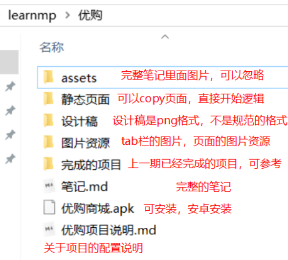

## 接口

在线文档地址：https://www.showdoc.cc/696455032746099?page_id=3984516634822174

生产环境的域名为：https://www.uinav.com

另一个后台环境： https://api-ugo-dev.itheima.net 

另一个环境：（不能完成支付，而且比较慢）https://api.zbztb.cn

说明：

在所有的url中，凡是带有my的，服务器都是需要验证token的

登陆接口需要切换appid: wx38d8faffac4d34d2

## 项目链接

课堂上项目链接     https://gitee.com/jovenwang/uni-yougou50/tree/Fea_joven_20200711 

## **优购文件夹目录说明：**

2. **静态页面：包含所有页面的静态页面**
3. 图片资源：是项目里面用到的images
3. 完成的项目
4. 设计稿截图：即是设计稿
5. 笔记: 优购商城全部的笔记
6. 优购商城.apk：已经完成的优购商城app，只支持安卓安装

