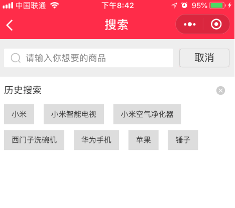
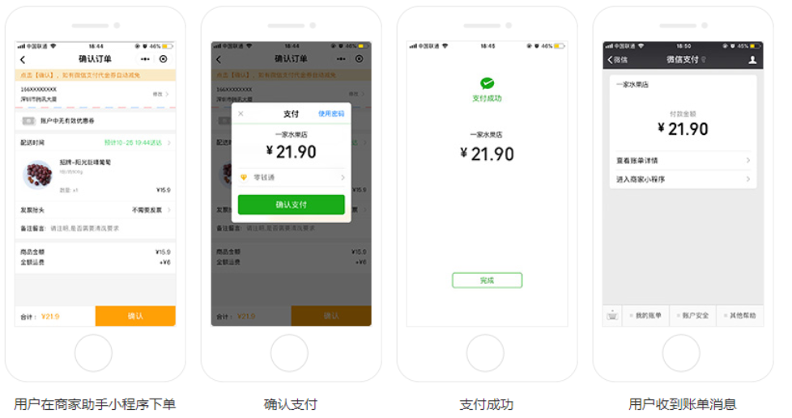

## 优购商城介绍

1. 演示app，h5及微信小程序
2. 优购小程序是商城，购物的逻辑可以参考京东App和小米lite小程序
3. 基本流程是这样的，点商品去到商品详情，添加购物车，结算付款，查看订单


**完整项目链接 https://gitee.com/jovenwang/uni-yougou**

**课堂上项目链接 https://gitee.com/jovenwang/uni-yougou45/tree/Fea_joven_20200302**


**优购文件夹目录说明：**

1. 后台代码
   1. 这个是优购项目的后台，**课堂上不用**，直接调服务器地址。
   2. 部分同学想部署项目到服务器，可以使用
   3. 涉及到原理，上课也可会打开后台代码看
2. **静态页面：包含所有页面的静态页面**
3. 图片资源：是项目里面用到的images
4. 项目截图：即是设计稿
5. 笔记: 优购商城全部的笔记
6. **微信小程序-优购API，两份一样，pdf容易打开些**
7. 优购商城.apk：已经完成的优购商城app，只支持安卓安装


## 移动开发

| 开发方式         | 平台                                                         | 逻辑       | 视图              | 用户体验   | 开发周期     |
| ---------------- | :----------------------------------------------------------- | ---------- | ----------------- | ---------- | ------------ |
| 原生(Raw)        | iOS: Object C、Swift<br />Android: Java、Kotlin              | 原生       | 原生              | 好         | 长，审核太慢 |
| 移动Web(h5)      | 浏览器                                                       | js         | HTML、css         | 无原生能力 | 短           |
| H5混合（hybrid） | 移动web+原生壳，原生提供浏览器webview，可以加载网页，**还有访问原生的能力** | js         | HTML、css         | 一般       | 短           |
| 原生混合         | React Native与Weex(把js、html、css转成原生代码)              | js         | 原生              | 稍好       | 较短         |
| 小程序           |                                                              | JavaScript | 小程序组件、css等 | 好         |              |


1. 原生

   3. 主要是因为开发周期长，审核时间长
   4. 苹果一般两周，安卓需要小米商店，华为应用，应用宝
      1. 审核比较严
         1. 要求你的APP必须有注册功能
         2. 不能金融功能
         3. 所以需要弄个配文件，关闭和开启金融和注册功能
   5. 很少有纯原生的写的应用
   6. 除非对性能要求极高的。直播

2. 移动Web

   1. 没有原生能力
   2. 开发微信公众账号
   3. 大多数都作为一个引流的入口

3. H5混合（黑马头条的h5打包成App）

   1. 把移动网页打包到一个壳子中，安装到手机上去使用
4. 性能和开发效率都不错，市场大部分用这种模式
   3. 95%以上的代码还是h5，另外小于5%是Js调用生
5. **一套代码安卓、ios和h5，但是复杂的动画是不是行**
   5. 无须审核
6. js和原生通信
   1. 当我们用window.alert，原生java有方法可以获取到字符串的传参
   2. window.alert('leka://com.package.user/getCamcra'),window.confirm,window.prompt

7. 原生混合

   1. 语法稍有学习成本，只能兼容iOS和安卓
   2. 对性能要求稍好的项目会用
   3. 性能：原生>原生混合>h5混合

9. 小程序

   1. 开发成本低，体验好
   2. 一般是App版的阉割版本，作为引流


## 原生小程序与第三方小程序框架们

原生小程序即微信小程序官方提供的语法。

**原生小程序的痛点：**

1. 开发工具：微信开发者工具，没有vscode好用
2. 对前端工程化支持不好。比如npm安装, 引入框架
3. 似曾相识的小程序语法
4. 不能使用 less、scss 等预编译器

**为什么要使用第三方小程序框架**

1. 只要熟悉vue或react即可快速上手,学习成本低
   1. 熟悉的前端工程化，css预编译，npm包都支持
2. 一套代码可在多端编译运行(微信,支付宝,h5,RN) 支付宝小程序暂不完善
3. 几个常见的第三方小程序框架对比
   1. wepy只支持微信小程序，类vue语法
   2. mpvue支持各种小程序
      1. 优化了一些wepy的特性，创建的框架
      2. 不支持H5
   3. uniapp支持各种小程序、h5、App, 用Vue语法
   4. Taro支持各种小程序，React语法

**扩展：**

1. 很多地方都说"原生xx", 这里原生可以理解成官方提供的语法
   1. 比如`原生App`，那么就是java开发的安卓或者object-c开发的苹果App
2. 跨端开发框架：一套代码支持多个平台的框架
3. 跨端开发框架对比，uniapp算是优秀
   1. [传送门](https://juejin.im/post/5ca1736af265da30ae314248)


## Dcould(数字天堂)的产品

1. **HBuilder** X开发工具，类似于vscode
2. **uni-app**一套代码支持多端的框架
4. **H5+** 混合模式的App
5. MUI基于H5+的UI库

特点：

1. DCould公司的文档写得挺详细的，多看看可以更快点满前端技能点
2. 各个产品适合学习，做小型公司的产品

> dcould公司的文档不错，不用再抱怨文档不好了


## 开发工具HBuilder和HBuilderX

[传送门](https://www.dcloud.io/hbuilderx.html)

也是一款强大的前端IDE（绿色版），最好注册账号登录，**建议下载App开发版本**（支持打包apk）

1. 可以使用vscode的快捷键方案
2. 支持vue语法
3. 支持打包apk
4. 支持真机调试
   1. h5页面开发时希望在手机上，边改边看到效果
5. 支持暗黑主题

**注意解压文件时，文件比较多，耐心等。**

> 国产IDE？不存的，底层是eclipse. 可以理解成MIUI和安卓的关系


## *HBuilder基本使用

新建`5+App`,选择Hello mui模板

1. 浏览器运行
   1. 选中index.html，运行->选择浏览器
2. 真机调试
   1. 运行->选择手机
   2. 要选择项目
   3. 如果基座安装不成功的话，下载hbuildber_base.apk进行安装
3. 打包apk

   1. 发行->云打包
   2. 勾选安卓，选择使用公有证书 
   3. 等待生成apk，下载安装即可
4. 底部的控制台会显示`项目名-平台`
   1. 右侧可以重启，停止项目
5. 在项目结构里面可以直接粘贴


#### hbuilder连结手机：

1. 打开手机开发者选项->打开USB调试,连接后确认
2. 安卓：可能驱动不完善，先试着连结应用宝或者360手机肋手
3. windows连结ios需要安装itunes
   1. 安装完itunes提示重启电脑，连接itunes信任设备，运行项目安装基座，信任证书就ok了
4. [查看连结帮助](https://ask.dcloud.net.cn/article/97)

#### 注意点：

1. 建议调试用iphone
2. 安装App用安卓
3. 保证解压的hbuilder完整的

> ios企业开发者账号，可以不通过AppStore审核使用。

#### 练习：

1. 下载安装hbuilder
2. 创建hellomui,完成真机运行
3. 发行->云打包
4. 安装apk到手机上
5. 再体验一下hellomui App


## *H5+基本使用

[传送门](https://ask.dcloud.net.cn/article/89)

开发H5混合模式的App，把一些常见的原生能力内置，令到JavaScript能调原生

1. 拨打电话

   ```js
   plus.device.dial(15361819220) 
   ```

2. 拍照

   ```js
   let camera = plus.camera.getCamera()
   camera.captureImage()
   ```

#### 注意点：

学习h5+ API, 让我们更加理解混合App


## uni-app介绍

[传送门](https://uniapp.dcloud.io/)

**是什么？**uni-app是一个使用vue.js开发“所有”前端应用的框架

**如何使用？**

1. 支持vue.js语法
2. iOS、Android、H5、以及各种小程序（微信/支付宝/百度/头条/QQ/钉钉）等多个平台 
3. 适合开发小公司的项目, 特别适合于学习。
   1. 企业需要定制自己原生API，uni-app支持得不好
   2. 核心代码闭源
   3. 打包App，需要云打包，代码泄露
4. uni-app同样支持浏览器运行, app运行及打包成apk，微信开发者工具


## uni-app文档简介

[传送门](https://uniapp.dcloud.io/)

1. 介绍：入门教程
2. 框架：框架原理方面
3. 组件
4. API
5. 插件市场：有很多成熟的项目可参考(抄袭)


## HBuilder创建uniapp

[传送门](https://uniapp.dcloud.io/quickstart?id=_1-%e9%80%9a%e8%bf%87-hbuilderx-%e5%8f%af%e8%a7%86%e5%8c%96%e7%95%8c%e9%9d%a2)

1. 新建项目，选择uniapp，默认模板
2. 浏览器运行
3. app运行及打包成apk
4. 微信开发者工具运行

#### 注意点：

1. **支持微信开发者工具打开**
   1. 选择微信开发者工具的位置
   2. 工具->安全->开启服务端口

2. uni-app有很多好的模板可以使用和参考(fuzhi)
3. 项目依赖的插件需要安装插件 工具->插件安装（less、sass）


## Vue脚手架的方式创建uniapp

[传送门](https://uniapp.dcloud.io/quickstart?id=_2-%e9%80%9a%e8%bf%87vue-cli%e5%91%bd%e4%bb%a4%e8%a1%8c)

**推荐用这个方式创建uniapp**

1. 可以体验完整的vue脚手架项目
   1. hbuilder创建的项目，藏了一些目录
2. 可以用我们熟悉的vscode
   1. 不用打开hbuilder

**如何创建呢？**

1. 存放项目的目录下执行命令

   1. 根据提示选择对应的模板

   ```bash
   vue create -p dcloudio/uni-preset-vue 项目名
   ```

2. 在项目目录下执行命令

   1. `dist/mp-weixin`目录下即是生成的微信小程序源码

   ```bash
   npm run dev:mp-weixin
   ```

3.  微信开发者工具导入`dist/mp-wexin`目录

4. npm run serve运行h5

5. 真机运行或者打包apk

   1. 把整个工程拖到hbuilder中


## npm安装终极解决方案

1. 确认npm源为taobao源

   1. 执行npm config list，看提示，确认是不是taobao源

   2. 如果不是，执行

      ```bash
      npm set registry https://registry.npm.taobao.org/
      ```

   3. 不要用cnpm，cnpm解压包的试和npm不一样，容易导致莫名错误

2. 执行命令，权限不足

   1. 'oparation'的提示，基本上都是权限的问题
   2. windows以管理员的身份打开git bash或者cmd, 再执行命令
   3. Mac里面 **sudo**再命令再执行

3. 有`.staging`error的，就运行`npm cache clean --force`

4. 网络的问题

5. npm install动不了，直接ctrl+c。删除掉node_module再进行npm install


## uni-app的工程结构

[传送门](https://uniapp.dcloud.io/frame?id=%e7%9b%ae%e5%bd%95%e7%bb%93%e6%9e%84)

原汁原味的Vue脚手架4.0的项目结构，

重点看src目录

```
┌─components            uni-app组件目录
│  └─comp.vue         	可复用的comp组件
├─pages                 所有的页面
│  ├─index				index页面
│  │  └─index.vue       页面的逻辑结构与样式
│  └─list               list页面
│     └─list.vue        
├─static                存放静态资源（图片）
├─main.js               Vue初始化入口文件
├─App.vue               应用配置和App全局样式(编译成小程序的app.js和app.wxss)
├─manifest.json         打包App相关的图标、app名字，小程序的appid等
├─pages.json            配置页面路由、导航条、选项卡等页面类信息(可理解成小程序的app.json)
└─uni.scss              预置scss变量
```

1. 页面直接是.vue文件，页面路径的配置在pages.json里面
2. pages.json配置路由，导航条和Tab栏等，同小程序app.json的页面管理部分
   1. path是页面路径
   2. style是页面的配置
   3. globalStyle是设置应用的状态栏、导航条、标题、窗口背景色
   4. tabBar配置和小程序一样
3. manifest.json包括app.json的非页面管理部分，还有App相关配置

#### 理解技巧：

总的来说vue脚手架生成的工程结构非常像，其实它也是nodejs+webpack的工程，只不过隐藏一些文件。


## uni-app框架简介

[传送门](https://uniapp.dcloud.io/frame)

**uni-app 使用vue的语法+小程序的标签和API。**

1. 组件view,text,navigator,image,input,button,swiper...
   1. 基本组件和微信小程序一至
2. 正宗的Vue语法
3. wx对象换成uni对象，但是wx依然能用
4. css的变化
   1. 使用rpx和px单位
   2. flex布局
5. 生命周期钩子函数一样
   1. [传送门](https://uniapp.dcloud.io/frame?id=%e7%94%9f%e5%91%bd%e5%91%a8%e6%9c%9f)

#### 注意点：

1. 大部分html标签能识别，但是不同平台上兼容性很差，**不要使用非uni-app组件外的标签！！！**
2. 如果按规范来写的话，兼容是最好的

**练习：**

1. 试一下swiper
2. 有一个div块，背景是红色的，点击显示/不显示红色。


## 优购案例-准备

1. 以命令行的方式选择默认模板，创建项目`uni-yougou45`

   ```bash
   vue create -p dcloudio/uni-preset-vue 项目名
   npm run dev:mp-weixin //运行项目
   ```

   

2. 微信开发者工具查看运行效果

3. 码云仓库管理
   1. 新建仓库名`uni-yougou45`, 按提示把本地文件夹推送到远端
   2. 新建开发分支`Fea_joven_20200302`
      1. 大家根据自己的实际情况命名


## 优购案例-tarBar设置


1. 创建四个页面home,cart,category,me
2. copy tabBar配置
3. 导入tabs图片资源到static目录

#### 提示

1. tabbar里面iconpath和selectedIconPath图片相对路径和绝对路径都可以
2. 新增页面webpack无法感知，需要重启server


## 优购案例-首页


#### 01.页面分析

1. 入口页面，默认显示首页
2. 展示轮播图，分类及楼层。功能上简化了，点击图片均不会有跳转。
3. 点击搜索去到搜索页面

#### 02.静态页面

1. 设置标题

```json
{
  "navigationBarTitleText": "优购",
  "navigationBarBackgroundColor": "#eb4450",
  "navigationBarTextStyle": "white"
}
```

2. 头部搜索

   ​	1. icon

3. 轮播图

   1. swiper组件
   2. circular="true"无限轮播

4. 分类导航区域

   1. display:flex展示四张图片

6. 楼层区域

#### 03.请求数据&渲染数据

1. 渲染轮播图部分

2. 接口：/api/public/v1/home/swiperdata

3. 渲染分类导航部分

   1. 接口：/api/public/v1/home/catitems

4. 渲染楼层部分

   1. 接口：/api/public/v1/home/floordata

   > content-type: application/json这种设置和后端有关
   >
   > 返回数据解析用解构语法

#### 04.wx.request封装

1. request.js封装wx.request

2. request设置到Vue原型上，Vue实例上都可以访问到$request

   1. 在main.js里设置

      ```js
      import request from '@/utils/request'
      Vue.prototype.$request = request
      ```

 3. 提取BASE_URL

#### 05.进一步优化

  1. async和await优化

     1. await作用是返回promise对象then里面的数据
     2. async作用有await的代码的function必须用async修饰
  2. 封装wx.request部分，添加loading

     1. 默认不传参且有loading，showLoading默认为true
     2. loading mask设置为true
  3. 导航栏背景色和颜色的全局设置

#### 注意点：

1. 后端返回的数据res.data.message，promise resolve 不要resolve(res)


## 优购案例-分类


#### 01.页面分析

1. 点击分类Tab显示这个分类页面

 2. 点击搜索去到搜索页面
  3. 选中左侧其中一个一级分类，右侧显示对应的二级和三级分类

#### 02.静态页面

1. 将头部搜索区域封装为组件

   1. 组件的style需要加scoped，否则会影响到引入组件的页面

2. 主体部分需要占满剩下屏幕

   >内容滚动的条件是
   >
   >1. 父元素高度小于内容高度
   >2. 父元素高度确定
   >3. 父元素overflow:auto或者scroll

   ```css
     position: absolute;
     top: 100rpx;
     left: 0;
     right: 0;
     bottom: 0;
   ```

3. 左侧的结构

   1. 基本结构
   2. 选中的样式
   3. 点击切换选中元素

4. 右侧的结构

   1. 顶部图片展示

   2. 二级分类和三级分类结构


#### 03.获取数据&渲染数据

接口：/api/public/v1/categories

1. 获取数据
2. 渲染左侧
3. 渲染右侧二级
4. 渲染右侧三级

> 1. v-if用在请求没回来之前，不渲染数据的逻辑，这里不能用v-show来替代
> 3. 右侧二级三级分类的渲染categories[activeIndex]


## style要不要加scoped

scoped可以把样式限定在组件内，如何做到的？

```html
<view class="nav data-v-087d42bb">
```

```css
.nav image.data-v-087d42bb {
  height: 140rpx;
  width: 128rpx;
}
```

页面的样式是相互独立的，无须在页面的style加scoped

页面引入组件，组件样式会影响页面，所以需要加scoped

#### 注意点：

1. 每次运行到小程序模拟器，都会重新生成mp-weixin目录


## 下拉刷新

[传送门](https://developers.weixin.qq.com/miniprogram/dev/reference/configuration/page.html)

小程序为页面增加下拉组件，**下拉时触发方法**，在方法里面我们可以自定义逻辑，通常用来重新加载第一页数据

1. 在页面设置index.json

```json
"enablePullDownRefresh":true,
"backgroundTextStyle": "dark"
"backgroundColor":"#ccc"
```

2. 下拉会触发onPullDownRefresh，一般在这个方法里面**处理加载第一页的逻辑**

3. backgroundColor 窗口的背景色

4. backgroundTextStyle 下拉 loading 的样式 `dark` / `light`，默认是light


## 下拉刷新-计数器案例

1. 新建一个页面`pages/pulldown_counter/index`

2. 显示数字，点击按钮+，自增

3. index.json增加"enablePullDownRefresh":true

4. backgroundColor:"#ccc"及backgroundTextStyle :"dark"

   

需求：页面上显示一个数字，点击+数字自增，下拉刷新时，数字重置为0

> 手动停止下拉loading动画 wx.stopPulldownRefresh


## 上拉加载更多

[传送门](https://developers.weixin.qq.com/miniprogram/dev/reference/configuration/page.html)

小程序为页面增加上拉组件，**上拉到底前**触发方法，在方法里面我们可以自定义逻辑，通常应用在分页的场景中，加载下一页

1. 在页面设置index.json

```json
"onReachBottomDistance":50
```

2. 下拉到底前会触发[onReachBottom](https://developers.weixin.qq.com/miniprogram/dev/reference/api/Page.html#onreachbottom)

3. 注意点，只有有滚动条的时候，上拉才会被触发

4. 在onReachBottom方法里面，一般处理加载下一页的逻辑

   

## 练习-下拉上拉-综合案例

参考<https://dev.dcloud.net.cn/mui/>

1. 新建一个页面，展示列表。

2. index.json配置开启上拉加载和下拉刷新

3. 在上拉加载里面，添加数据。下拉刷新里面加载第一页。

   ```js
    setTimeout(() => {
        this.setData({
            list: numArr
        })
        //主动结束下拉刷新
        wx.stopPullDownRefresh();
    }, 500)
   ```


## 优购案例-搜索列表


#### 01.页面分析


1. 点击三级分类，去到搜索列表页面，传递cat_name
2. 获取列表数据的接口是查询关键字，支持分页
  3. 下拉刷新，上拉加载更多
  4. 输入框输入关键字，搜索
  5. 点击其中一个商品跳转商品详情

#### 02.静态页面

2. 新建页面search_list
3. 标题设置为`搜索结果`
4. 头部搜索功能
5. 过滤栏综合销量及价格展示
6. 过滤栏点击选中功能
7. 商品列表展示

#### 03.基本逻辑

1. 过滤栏点击某一项添加选中样式
   1. 声明一个过滤栏菜单数组
   2. 点击activeIndex=index
   3. 选中即添加active样式
2. 点击三级分类，去到搜索列表页面
   1. 点击跳转 @click="toSearchList"
      1. wx.navigatorTo()
      2. 传递cat_name
   2. 在搜索列表页面上获取参数
      1. 在onLoad方法里面 参数

#### 04.请求数据&渲染数据

1. onLoad设置keyword, 请求数据queryGoods
   2. 接口 /api/public/v1/goods/search
   3. 参数
      1. query关键字
      2. pagesize每页多少条
      3. pagenum 页码(从1开始)
2. 渲染数据
3. 输入框输入关键字，确定的时候触发搜索商品
   1. 获取输入框的输入keyword
   2. 点击确定触发搜索@confirm:queryGoods

#### 05.下拉刷新

1. 配置开启下拉刷新, 并配置样式

   ```
     "enablePullDownRefresh": true,
     "backgroundColor": "#eee",
     "backgroundTextStyle": "dark"
   ```

2. 触发下拉刷新事件重新请求数据

   1. onPullDownRefresh方法里
      1. 重置goodsList
   2. 发请求
   

#### 06.上拉加载更多

1. 配置开启上拉 "onReachBottomDistance":50
2. 上拉触底后给当前页+1，再请求
   1. onReachBottom方法里页码+1, 再请求
   2. 商品列表应该是追加，而不是覆盖

#### 07.优化

1. 输入框确定、下拉刷新，搜索结果为第一页
   1. 搜索结果为首页，单独抽取一个方法reload
   2. reload重置页码为1，重置goodsList

2. 当请求中，不再发请求
   1. 设置请求中状态isRequest
   2. 请求前，为true
   3. 请求后为false
   4. 如果为true时，return
3. 如果当前是最后一页，不再发请求
   1. 是否为最后一页的状态isLastPage
   2. 如果是最后一页，不再发请求
4. 添加一个有加载完成的提示
   1. isLastPage为true时显示


## 小程序生命周期钩子

#### 01.App生命周期

[传送门](https://developers.weixin.qq.com/miniprogram/dev/reference/api/App.html)

1. App在初始化，切前台后台时会以回调函数的形式通知我们

   | 钩子函数 | 说明                             |
   | -------- | -------------------------------- |
   | onLaunch | 小程序初始化时触发（只触发一次） |
   | onShow   | 从后台进入前台                   |
   | onHide   | 从前台进入后台                   |


#### 02.Page生命周期

[Page生命周期](https://developers.weixin.qq.com/miniprogram/dev/framework/app-service/page-life-cycle.html)

Page在加载、显示、渲染完成、隐藏和销毁时会以回调函数的形式通知我们

| 钩子函数 | 说明             | 备注 |
| -------- | ---------------- | ---- |
| onLoad   | 页面加载         |      |
| onShow   | 页面显示         |      |
| onReady  | 页面初次渲染完成 |      |
| onHide   | 页面隐藏         |      |
| onUnload | 页面销毁         |      |

> window.onload
>
> document.onDomContentLoaded


#### 03.页面栈的概念

[传送门](https://developers.weixin.qq.com/miniprogram/dev/framework/app-service/route.html)

在调试器的`AppData`查看当前活动页面，

使用 `getCurrentPages()` 函数获取当前页面栈 

| 路由方式   | 页面栈表现                      | 方法                        | 当前页面 | 后页面        |
| ---------- | ------------------------------- | --------------------------- | -------- | ------------- |
| 打开新页面 | 新页面入栈                      | wx.navigateTo               | onHide   | onLoad,onShow |
| 页面返回   | 页面不断出栈，直到目标返回页    | 左上角返回，wx.navigateBack | onUnload | onShow        |
| Tab切换    | 页面全部出栈，只留下新的Tab页面 | wx.switchTab                |          |               |

1. Tab栏只会初始化第一个页面，第一次切换到某tab时才会初始化该Tab; 后续切换tab只会显示/隐藏

2. 只有一个tab栏会入栈

3. tab栏只要初始化了并不会销毁

   

#### 04.uniapp生命周期图

[uniapp的生命周期](https://uniapp.dcloud.io/collocation/frame/lifecycle)

1. uniapp应用生命周期和小程序一致
2. uniapp页面生命周期和小程序一致，不建议用vue的生命周期
3. uniapp组件的生命周期建议用vue的生命周期

#### 05.场景值

[传送门](https://developers.weixin.qq.com/miniprogram/dev/reference/scene-list.html)

概念：小程序的入口，不同入口都有的标识，这个就是场景值

一般用作**事件上报**

1. 页面被访问的次数PV
2. 页面被不同用户访问的次数UV
3. 事件上报针对某一按钮

获取场景值：app.js onShow(){options. scene }


## 优购案例-搜索列表

#### 07. 搜索和过滤栏固定定位，不随着商品列表滚动

[onPageScroll](https://developers.weixin.qq.com/miniprogram/dev/reference/api/Page.html#onPageScroll-Object-object)

1. 绝对定位方案
   1. 上滑时，搜索和过滤栏不随商品列表滚动
      1. onPageScroll：isFixed=true
   2. 下拉刷新顶部loading
      1. onPullDownRefresh：isFixed:false
2. 粘性定位
   1. position:sticky相对于最近一个滚动容器
      1. 使用top,left,right,bottom定位

#### 08.无须在结构渲染的变量不要声明在data里面

1. pageNum
2. isRequest

#### 09.自测

1. 输入框输入关键字，商品列表展示第一页搜索商品
2. 下拉刷新，商品列表展示第一页搜索商品
3. 上拉加载，加载下一页商品
4. 分类页点击三级分类，输入框显示对应的三级分类的名称，商品列表展示第一页搜索数据


### 字体图标

[阿里矢量图标库](https://www.iconfont.cn/)

使用方法：

1. 搜索图标
2. 添加图标到购物车
3. 购物车里面添加进项目
4. 项目里生成在线代码

注意点

1. uniapp里面不支持网络路径样式引入


## 分享功能

[传送门](https://developers.weixin.qq.com/miniprogram/dev/framework/open-ability/share.html)

[onShareAppMessage](https://developers.weixin.qq.com/miniprogram/dev/reference/api/Page.html#onShareAppMessage-Object-object)

分享当前页面

1. 添加一个组件button，设置属性open-type="share"
2. 用户点击按钮后触发 `Page.onShareAppMessage` 事件
3. onShareAppMessage的参数可以定制分享的弹窗内容
   1. title 标题，默认为当前小程序的名称
   2. imageUrl 图片，默认是一张随机图片
   3. path 转发路径（别人点你的分享链接，跳转的页面路径），默认当前页面路径


## 联系客服

[传送门](https://developers.weixin.qq.com/miniprogram/dev/framework/open-ability/customer-message/customer-message.html)

1. 添加一个组件button，设置属性open-type="contact"

2. 后台需要接入客服系统

   

## 优购案例-商品详情页


#### 01.案例分析

1. 搜索列表的商品，点击可进入商品详情
2. 商品详情展示轮播图，可点击放大查看
3. 商品详情展示商品价格，名称，规格，送货地址及图文说明
4. 联系客服，加入购物车，或者直接购买。

#### 02.静态页面

1. 新建页面item
2. 商品详情页&搜索页跳转商品详情
3. 轮播图
4. 商品信息
5. **使用字体图标**
6. 促销区域
7. 图文介绍与商品参数头部
8. 图文介绍与商品参数头部切换逻辑
9. 固定底部

#### 03.获取数据&渲染数据

1. 获取数据

   1. 搜索列表页点击商品跳转商品详情，传入goodsId
   2. 根据接口请求商品详情
      1. 接口 `/api/public/v1/goods/detail?goods_id=${goodsId}`

2. 渲染数据

   1. 轮播图

      1. 字段`pics`

   2. 预览图片

      点击轮播图其中一张图片，会打开页面预览被点击图片，左右滑动可以预览其他图片
   
      1. 给轮播图片设置点击事件
      2. 调用wx.previewImage在新页面中全屏预览图片
         1. current当前显示图片的链接
      2. urls需要预览的图片链接列表
      3. 传入相应的参数

   3. 动态渲染商品价格和名称

   4. 渲染商品详情图文说明

      1. v-html支持只包含img标签html str
   2. 基本所的电商网站，商品详情的图文介绍，都是图片和简单的文字
      
   3. 经验分享：后台添加商品时，可以同时生成分享图片，获取商品详情时，返回分享图片url属性
      
   5. 分享功能
   
      1. 添加一个组件button，设置属性open-type="share"
   2. onShareAppMessage方法中设置标题
      3. 解决样式问题
      1. 定位
         2. 隐藏
      4. 预览扫码体验
   
6. 联系客服功能
   
      1. 添加一个组件button，设置属性open-type="contact"
      2. 解决样式问题
         1. 定位
         2. 隐藏


## Vue组件通信

#### 01.父传子

 1. 父组件使用子组件标签中添加属性并赋值

    ```html
    <child message="父传给子的值"></child>
    ```

 2. 子组件中props声明对应属性

    ```js
    Vue.component('child',{
        template:'#chlidTpl',
        props:['message']
    })
    ```

注意点：

1. 在HTML 中，驼峰命名prop名需要转换成等价的`-`分隔命名

2. vue文件中没有这个限制？？

   1. [传送门](https://cn.vuejs.org/v2/guide/components-props.html#Prop-%E7%9A%84%E5%A4%A7%E5%B0%8F%E5%86%99-camelCase-vs-kebab-case)

   ```html
   <child parent-msg="父传给子的值"></child>
   ```

3. 不应该在一个子组件内部改变 prop ，最好 定义一个data 属性并将这个 prop 用作其初始值 ，保持组件的单身数据流

   ```js
   props:['message'],
       data(){
       return{
           info:this.message
       }
   }
   ```

#### 02.父传子动态

```js
watch:{
    message(newValue){
        this.info = newValue
    }
}
```

#### 03.练习-父传子，动态传递对象

1. 基于vue-cli脚手架，快速原型开发
  2. 验证传属性时，能不能用驼峰，能够
  3. 父传子，传对象的话，子改对象会不会报错？？不会


#### 04.子传父

1. 子组件中 $emit来触发一个自定义事件，并传递一个参数 

   ```js
   this.$emit('child-event','子传给父的消息')
   ```

2. 父组件里使用子标签中监听该自定义事件并添加一个响应该事件的处理方法 

   ```html
   <child @child-event="showChildMsg"></child>
   ```

注意点：

[事件名](https://cn.vuejs.org/v2/guide/components-custom-events.html#%E4%BA%8B%E4%BB%B6%E5%90%8D)

1. 推荐总是使用`-`分隔的方式命名事件名（.vue文件中没这种限制）

#### 05.子传父与v-model

1. 将其 `value` 特性绑定到一个名叫 `value` 的 prop 上 

   ```html
   <input type="text" :value="msg" @input="sendMsg2Parent">
   ```

2. 在其 `input` 事件被触发时，将新的值通过自定义的 `input` 事件抛出 

#### 06. $attrs 和$listeners使用

[传送门](https://cn.vuejs.org/v2/api/#vm-attrs)

方便爷组件和孙组件通信，透传

```html
<Son v-bind="$attrs" v-on="$listeners"/>
```


#### 07.兄弟通信

 eventBus我们只创建了一个新的Vue实例，以后它就承担起了组件之间通信的桥梁了，也就是中央事件总线。 

1. 组件1通过eventBus.$emit来触发一个自定义事件，并传递参数

   ```js
   eventBus.$emit('toChild2','组件1传给组件2的值')
   ```

   

2. 组件2通过尽早通过eventBus.$emit监听该自定义事件，并添加事件处理方法

   ```js
   create() {
       eventBus.$on('toChild2',function(data){
           console.log(data)
       })
   }
   ```


## 优购案例-搜索列表

#### 抽取头部输入框为单独的组件

1. search_list页面引入SearchBar.vue组件
2. 设置输入框confirm-type="search"
3. SearchBar.vue组件中，输入框有内容就展示x按钮，没内容就不展示x按钮
   1. 获取输入内容v-model.trim:keyword
   2. 是否展示x按钮 v-show="keyword"
4. 点击x按钮清空输入框内容

   1. 事件@click:keyword=''
5. 输入框回车，触发搜索商品

   1. SearchBar组件keyword不为空时，$emit一个query事件
   2. search_list页面注册一个@query事件，在事件里面触发搜索
   3. 触发搜索需要先设置keyword，再reload
6. 设置搜索列表的初始值

   1. SearchBar标签，绑定:query=“keyword”
   2. SearchBar组件，props接受query, data里面初始化keyword? 无效！


## 优购案例-搜索页面



#### 01.页面分析

1. 首页和分类页搜索热区，点击跳转到搜索页面
2. 输入框输入，点键盘右下搜索，去到搜索列表页
3. 点历史搜索关键字，去到搜索列表页
4. 搜索历史记录存储到storage
5. 输入框中有内容就展示x，点击x清除内容

#### 02.静态页面

1. 新建搜索页search
2. 搜索顶部
3. 历史搜索

#### 03.基本逻辑

1. 首页和分类页搜索热区，点击跳转到搜索页面
2. 输入框回车，跳转到搜索列表页
   1. 搜索页面注册事件@query:toSearchList
   2. 跳转到搜索列表页 /pages/search_list/main?query=${data}
3. 展示历史搜索列表，存储在storage中
   1. data里面从storage中取数据`keywordList`
   2. 渲染列表
4. 输入框，历史搜索列表头部添加关键字，并保存
   1. 事件@query:toSearchList处理
   2. unshift给数组头部插入关键字
   3. 数组不能重复使用filter过滤
      1. 更好的方法用Set
   4. 存储到storage wx.setStorageSync
5. 页面返回时才显示添加的关键字
   1. 页面onShow或者onHide时,keywordList从storage里面取
      1. onShow还是onHide更好？
6. 点击历史搜索列表元素，跳转到搜索列表页, 同时元素添加到头部
   1. 元素点击事件@click:toSearchList(item)
   2. 跳转wx.navigateTo
   3. 数组在头部添加关键字，然后去重
   4. 然后存储
   5. onShow时，keywordList从storage里面取
7. 点击x的时候，清除搜索历史
   1. 事件@click：clearKeywordList
   2. 清除keywordList和storage
   3. 确认弹框wx.showModal


## 计算属性setter

[传送门](https://cn.vuejs.org/v2/guide/computed.html#%E8%AE%A1%E7%AE%97%E5%B1%9E%E6%80%A7%E7%9A%84-setter)

1. 计算属性默认的用法其实是计算属性的getter方法

2. 计算属性的setter方法里面可以获取到值变化

3. 如果不设置firstName或lastName，不会改变fullName的

4. 典型的应用场景是checkbox全选/全不选


#### 练习总结

1. 计算属性的set方法触发的条件是，计算属性的key有变化的时候

   

## 优购案例-购物车


#### 01.页面分析

1. 商品详情点购物车，或者tabBar点购物车去到购物车页面
2. 去掉收货地址选择，一般收货地址放在支付页面
3. 页面显示用户添加进购物车的商品列表，用户可选择商品，修改商品数量
   1. 实际项目一般购物车数据增删改查直接发请求, 可参考小米商城
   2. 购物车数据存在storage
      1. 购物车数据没有对应接口
      2. 小程序里面购物车数据存storage,有一定理由
4. 点结算去到支付页面
5. 购物车里面并不是所有商品都会结算，可以选择是否进行结算

#### 02.静态页面

1. 标题设置
2. 购物车信息头部
3. 购物车信息列表
4. 底部信息
5. **图标显示，iconfont引入**

#### 03.基本功能

1. 商品详情点购物车跳转到购物车页面

   1. 商品详情点击购物车 @click:toCart
   2. 跳转到购物车页面，uni.switchTab

2. 展示购物车商品列表

   1. 数据从哪来？从接口分析，接口只会返回部分数据，另一部分需要storage; 而且接口依赖storage存的购物车

      1. storage购物车的数据结构

         1. 购物车至少得有商品Id,商品的数量,商品有没有被选中的状态
         2. 用对象的形式还是数组的形式呢？
            1. 数组好，因为数组是有序的

         ```js
         //声明成obj,商品id为key，值里面包含num和选中状态两个属性
         cart = {
           商品id: {
             num: 商品数量, 
             checked:true
           }
         }
         
         //数组里面存对象，对象里面包含三个属性
         cart=[
             {
                 商品Id，
                 商品数量，
                 是否选中
             }
         ]
         ```

      2. storage购物车数据添加. 商品详情页面，点击添加购物车，把当前商品存储到storage购物车

         1. 可能我们存之前就有数据。所以思路：取storage购物车，改数据，再存回去
         2. 怎么改数据？无非改商品id，商品数量以及是否选中
            1. 存goodsId没问题
            2. 商品数量
               1. 第一次添加，数量为1
               2. 非首次添加数量++
               3. 如何判断是否是第一次添加呢?
            3. 选中状态
               1. 如果购物车里面用户勾选了商品，商品详情添加购物车，这个商品就是勾选的
               2. 如果购物车里面用户去勾选了商品，商品详情添加购物车，这个商品就是勾选的
               3. 总之，添加商品，总是选中的。
            4. 如果第一次添加，插入到数组最前面; 否则直接更改

      3. 购物车页面根据storage购物车数据发请求 

         1. 尽早地发请求onShow
         2. 取storage购物车数组每个对象的goodsId，拼成字符串
            1. map方法返回数组，然后join成字符串
            2. 调接口发请求，拿数据
            3. 如果购物车数据为空，不必请求

      4. 渲染页面

         1. 如何取storage购物车数组的商品数量或者选中状态？
            1. 太南了
            2. 解决方案：合并数据
               1. forEach结合展开运算符？
               2. map结合展开运算符
         2. 渲染商品名称，图片及价格
         3. 渲染复选框，点击的勾选/去勾选
            1. v-bind:class
         4. 商品数量修改
            1. -按钮最小值为1，1时disabled
            2. +按钮

3. 全选逻辑

   1. 所有商品选中时，触发全选选中状态;有一个商品不选中时，去勾选全选
      1. **every()是对数组中每一项运行给定函数，如果该函数对每一项返回true,则返回true。**
      2. **some()是对数组中每一项运行给定函数，如果该函数有一项返回true，则返回true。**
   2. 选中全选，所有商品选中;去勾选全选，所有商品不选中。
      1. 如果想真正改变计算属性，需要改变计算属性的依赖

   > // 如果所有商品都勾选的话，就true;详解：拿出goodsList.length==勾选商品的个数
   >
   > // 默认true,遍历goodsList，如果有一项没勾选的话，就false
   >
   > forEach不能够break; for of是可以break

4. 总数量和总价格
   1. 总数量显示

      1. reduce的用法

      ```js
      arr.reduce(function(上一次计算后的值，当前遍历中的元素)){
          return 上一次计算后的值与当前遍历中的元素的运算
      }，初始值)
      ```

   2. 总价显示

   3. 注意只有选中的商品才参与计算

5. 页面隐藏时onHide，保存cart状态到storage


## 优购案例-登录

#### 01.页面分析

1. 购物车页面点结算，如果未登录，跳转登录，否则跳转支付页面
2. 登录页上，点立即登录，登录成功，存token, 并goBack

#### 02.基本逻辑

| getUserInfo | 获取用户信息，可以从bindgetuserinfo回调中获取到用户信息 |
| ----------- | ------------------------------------------------------- |
|             |                                                         |

1. 购物车点结算，当然如果没有选择商品就提示;未登录跳转登录; 否则跳转支付页面
   1. 是否登录判断token
2. 登录页，立即登录
   1. getUserInfo+code，调登录接口
   2. 存储token并back

#### 练习注意：

> 1. 微信开发者账号，切换用户，截图让我扫码
>2. 微信开发者工具appid换掉：wx38d8faffac4d34d2
> 3. baseURL要更新了https://www.uinav.com


## 小程序微信支付

[传送门](https://pay.weixin.qq.com/static/product/product_intro.shtml?name=miniapp)

用户在微信小程序内唤起微信支付，完成支付返回微信小程序

使用示例



#### 申请流程

1. 申请小程序开发者账号

2. 微信认证

   1.  个人号无法认证

3. 小程序开通微信支付

4. 点击开通按钮后，选择新申请微信支付商户号或绑定一个已有的微信支付商户号，

5. 申请微信支付商户号

   1. [传送门](https://pay.weixin.qq.com/index.php/apply/applyment_home/guide_normal)
   2. 需要营业执照和银行卡号

6. 业务流程

   1. 

7. 后端调用`wxsdk.reqWXUnifiedorder`,传入appid，商户号，open_id等生成前端微信支付的参数。

8. 小程序调用wx.requestPayment，唤起微信支付

   

## 优购案例-支付

#### 01.页面分析

1. 购物车点结算，或者商品详情点立即购买去到支付页面
2. 支付页面展示收货地址选择以及需要确定购买的商品列表（**不能去选中及修改数量, 没有勾选**）
   1. 如果在H5页面的话，收货地址的新增，删除，修改都会调接口的
   2. 这里收货地址其实是同步微信的收货地址
      1. 微信，我->头像->我的地址，里面有微信的收货地址，这里同步微信的收货地址
3. 点击微信支付，生成订单，再微信支付
4. 支付成功或者失败进入订单结果页

#### 02.静态页面

1. **支付页面没有对应的设计稿**
2. 新建支付页面pay
3. 收货地址和选择收货地址
4. 收货地址边框
5. 商品列表copy，修改部分
6. 微信支付按钮，及订单信息也 

#### 03.基本逻辑

1. 购物车点结算跳转支付页面

   1. 商品数量不能为0
   2. 必须有token
   3. 满足条件才跳转支付页面
2. 点击请选择地址，选择微信地址，选择地址确定，获取地址，显示地址

   2. 点击请求选择地址@click="getAddress"
   3. 获取微信收货地址 wx.chooseAddress成功回调里获取
   4. 请选择地址显示为选择后的地址
3. 获取到收货地址后，缓存到本地; 页面初始化时从缓存中读取

> 没有登录的同学，可以直接进入pay页面，完成获取同步收货地址的功能


#### 04.请求数据&渲染数

1. 根据商品ids请求商品详情,**渲染购物车选中的商品**，方法getGoodsList

   1. 接口 `/api/public/v1/goods/goodslist?goods_ids=${ids}`
      1. 过滤掉未选中的商品
   2. storage里面未选中的商品过滤掉
   3. 总价格的显示，计算属性

2. 点击微信支付先生成订单

   1. 判断是否有商品，是否选择了地址

   2. 接口/api/public/v1/my/orders/create

      1. method:POST

      2. 请求头 "Authorization" : token

      3. data:{

         order_price 订单价格

         consignee_addr 订单地址

         goods 商品列表内部存放商品对象（goods_id，goods_number和goods_price）}

      4. 不论支付成功或者失败，都从购物车里面清掉选中的商品

         1. Array map

3. 生成订单成功后，生成预支付交易单

   1. 接口/api/public/v1/my/orders/req_unifiedorder
      1. method:POST
      2. 请求头 "Authorization" : token
      3. 请求体:
         order_number : 订单号

4. 生成订单后，调用uni.requestPayment


## 优购案例-优化(了解)

#### 01.商品详情-立即购买跳转支付页面

1. 传递goodsId
2. 展示立即购买的那个商品，数量为1
3. 无需存储到购物车storage

#### 02.设置购物车的商品个数

1. 购物车的onShow方法里面设置(无论商品是否选中，都算)
2. wx.setTabBarBadge
   1. index
   2. 显示文本，字符串类型
      1. 数量**商品类型个数**

#### 03.request中设置token

1. isAuth为true是添加token

#### 04.request错误提示

1. status不为200时，提示错误

2. fail网络超时

#### 练习注意点

1. 优购商城支付必须由登录用户支付


## 优购案例-订单结果页(了解)

#### 01.页面分析

1. 支付页面，支付取消或者支付成功，都会进入订单结果页

2. 订单结果页支付成功，展示成功状态和首页按钮，点首页按钮去到首页
3. 订单结果页支付失败，展示失败状态和首页按钮与订单详情按钮，点首页按钮去到首页，点订单详情去到订单详情

#### 02.静态页面

1. 文案及两个按钮

#### 03.基本逻辑

1. 支付页面上，支付成功和失败跳转订单结果页
   1. 失败时候传递orderNumber
2. 支付成功显示`首页`,并设置标题
3. 支付失败显示`首页`和`查询订单详情`，也设置标题


## 优购案例-订单详情(了解)

#### 01.页面分析

1. 订单结果点订单详情去到订单详情
2. 订单详情展示订单基本信息

#### 02.静态页面

1. 展示订单基本信息

#### 03.请求&渲染数据

1. 未登录跳转登录

2. 查询订单状态

   1. 接口 /api/public/v1/my/orders/chkOrder

      1. 请求方式POST

      2. 请求头:

         "Authorization" : token // 需要设置token带给后台

      3. 请求体:
         order_number : 订单号


## 优购案例-我的(了解)


#### 01.页面分析

1. 入口是tabBar
2. 展示登录状态收藏店铺、订单及其他信息
3. 已经登录展示用户头像和昵称，未登陆就显示登录，点登录跳转登录
4. 点订单跳转订单列表
5. 拨打电话的功能

#### 02.静态页面

#### 03.基本逻辑

1. 已经登录展示用户头像和昵称，未登陆就显示登录，点登录跳转登录
   1. login页userInfo添加到storage
   2. onShow里面获取到用户信息
   3. 点登录跳转登录
2. 拨打电话
   1. wx.makePhoneCall


## 优购案例-订单列表(了解)


#### 01.页面分析

1. 分别展示全部，待付款，已付款，退款/退货的订单列表
2. 在我的页面，点击订单去到订单列表

#### 02.静态页面

1. 顶部tab栏
2. 订单列表展示

#### 03.基本逻辑

1. 我的页面点击不同菜单去到订单列表，选中对应的tab
   1. 两边菜单并不是一一对应的，设置数组序列标志
2. 点击tab展示对应的列表

#### 04.请求&渲染数据

2. 渲染订单列表

   1. 接口`/api/public/v1/my/orders/all?type=1`

      1. 请求方式GET

      2. 请求头:

         "Authorization" : token //需要设置token带给后台

2. 切换Tab发送请求

>在调试器的，AppData里面，红色是数字类型，绿色是字符串。


## uniapp与Vuex的结合

vuex就是一个**全局变量**，存储整个所有组件的共享状态。

> 由于全局变量太灵活，vuex定义了一个操作全局变量的规范

核心概念：

1. state 状态
2. Getter是state的计算属性
3. Mutation改变state的方法
   1. 这里就操作全局变量的规范


## uniapp中使用Vuex

1. Hbuilder新建uniapp
   1. 新建store
   2. 在main.js中引入，store注册到new Vue中

2. 如果是用命令行创建uniapp
   1. 安装vuex
   2. 其他步骤同上


## 优购商城整合Vuex

主要思路：

小程序启动时，Vuex中购物车数据从storage里面读取，小程序隐藏时把购物车数据存到storage里面，在这之间购物车的一系列操作，只更改Vuex中购物车数据

1. 在手机上退出小程序会触发onHide钩子函数

#### 准备工作

1. 安装vuex

   ```
   npm install vuex
   ```

2. 新建文件`src/store/index.js`,并创建一个store

3. 在main.js中引入，store注册到new Vue中

4. 添加Vuex logger插件，方便打印日志


#### 页面逻辑重构

1. store里面购物车初始化
   1. store里面声明cart，并初始化从storage里面读取
2. App切后台，购物车数据存储到storage
   1. App.vue onHide方法触发
   2. store中添加getters.getCart方法
   3. 存储到storage
3. 购物车页面
   1. 添加购物车
      1. 在mutations中添加一个add2Cart
      2. item页面commit
   2. 购物车商品列表展示
      1. store getters获取cart数据

4. 购物车页面
   1. 购物车商品数量及选中状态直接更新state.cart
      1. 深度监听goodsList的变化，更新到state.cart
   2. 设置tab栏的徽标
      1. getters.getCart
   
2. 支付页面
   1. 展示商品列表
      1. getters.getCart
   2. 生成支付单后，删除购物车中勾选状态的商品
      1. mutations.arrangeCart


## H5和App兼容性问题解决

1. @click="不能在行内写逻辑"
2. ul和li转view
3. img换成image
4. 下拉刷新在h5里面需要手动停止动画
   1. 请求结束后uni.stopPulldownRefresh
5. 下拉刷新头部样式问题，需要z-index调整

> 登录后面这些功能是微信小程序才有的


## 发布

1. 更新应用名称和图标，打包apk，安装
2. 发布微信小程序
   1. 生成文件的路径 unpackage/dist/build/mp-weixin
3. 发行H5，并运行
   1. unpackage/dist/build/h5


