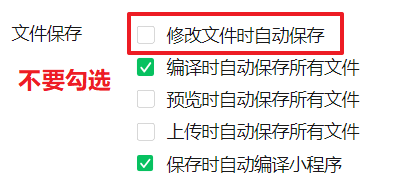
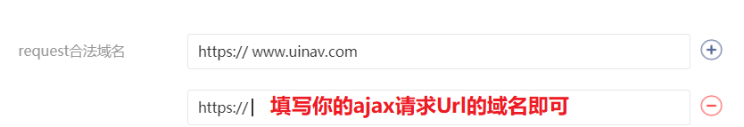
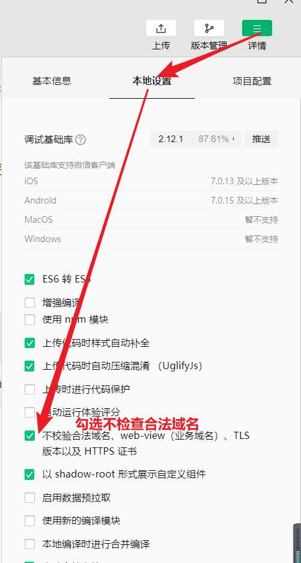

## day04 - 小程序

### 复习

优购 - 项目的介绍：

+ 使用 uni-app 完成的一个小程序
+ 一个电商类型的小程序
+ 电商是小程序就应用最广泛的一种

优购的资料

小程序中的框架对比：

+ mina
  + 官方框架
+ wepy
  + 使用 vue 的语法来开发小程序
  + 坑比较多的
  + tencent
+ mpvue
  + 使用 vue 的语法来开发小程序
  + 坑比较多，文档曾经一度无人维护
  + 美团
+ uni-app
  + 使用 vue 的语法来开发小程序
  + 一直在更新&维护
  + 数字天堂
+ taro
  + 既可以用 vue 来写代码
  + 也可以用 react 来写代码

Dcould - 产品

+ HBuilderX
+ uni-app

HBuilderX - 安装 & 使用它创建项目

HBuilderX - 运行项目到不同的环境中：

+ 浏览器
+ APP
+ 小程序

uni-app

优购项目

+ 创建项目
+ 设置 tab 栏

小程序中的自适应单 - rpx

+ rpx 与 rem 的作用完全一样
+ rem 是之前我们自己设置的
+ rpx 是小程序自动帮助我们设置好的


### 今日内容

解决同学们问题比较多的 bug

完成优购的首页

完成优购的分类页面


### 补充 - 配置APPID 


**原因**：

+ 在 uni-app 项目中没有配置 appid

**解决方案**：

+ manifest.json > 微信小程序配置 > 微信小程序AppID


### 补充 - 修改代码后小程序自动更新

**原因：**

+ 不少同学在 hbuilderX 中写完代码之后，小程序中的代码不会自动更新

**解决方案：**

+ 


### 补充 - 忽略unpackage目录

**unpackage 作用：**

+ 用来保存 uni-app 打包之后的项目的代码，相当于之前黑马面面中的 dist 目录
+ 这个文件夹在发送项目 & 项目提交到其实是不需要上传到 github 中的

**需求**：

+ 改动源码，生成一堆的unpackage目录下文件，这个需要忽略掉。

**步骤**：

+ 找一个`.gitignore`文件copy到`uni-yougou59`目录下

+ 在`.gitignore`文件添加忽略unpackage
  + `unpackage`

+ 删除unpackage目录，并一起推送到远端

**注意点：**

+  `.gitignore`文件作用让git忽略某些文件或者是文件夹，具体规则在文件内部

+ 如果远端有这个文件，再添加忽略规则的话，git忽略不会生效
  + 如果想生效的话，删除远端文件


### 首页 - 页面分析


+ 入口：打开小程序显示的第一个页面，点击底部首页tab，显示的页面

+ 主要模块
  + 搜索热区，轮播图，导航，楼层

+ 其他说明
  + 搜索热区并不是能输入，点击跳转
  + 页面点击无须支持


### 首页 - 静态页面

+ 页面设置导航栏
  + pages.json  `globalStyle`里面设置，属性名和小程序完全一致

    ```js
    "globalStyle": {
        "navigationBarTextStyle": "white",
        "navigationBarTitleText": "优购",
        "navigationBarBackgroundColor": "#eb4450"
    },
    ```

    

+ 安装less


+ 搜索热区
  + flex布局

+ 轮播图
  + 根据生成的swiper结构+接口返回的图片，改改就可以

+ 导航

+ 楼层
  + flex

**注意点：**

+ hbuilder生成的uniapp项目，安装npm包，直接工具->插件市场里面安装，兼容性是最好的

+ hbuilder提示，`u+组件名`就会给出组件对应的代码段
  + 路径提示"/单词"，敲单词时才会有提示

+ 小程序和uniapp基本和css样式是一样的。都支持


### 网络请求 - wx.request

[传送门](https://developers.weixin.qq.com/miniprogram/dev/api/network/request/wx.request.html)

> 首页轮播图API :    https://www.uinav.com/api/public/v1/home/swiperdata 

**有什么用**：

+ 微信小程序里面发ajax请求的

**原理**：

+ 基于也小黄人封装（XMLHttpRequest）

**步骤**：

+ 基本上和jQuery.ajax一样

+ header content-type默认值为"application/json"
  
+ 一般接口不用传，如果相应的报错，根据实际情况再改
  
+ wx.request不会返回promise，如果需要的话，需要自己封装

  ```js
  wx.request({
      url: 'https://www.uinav.com1/api/public/v1/home/swiperdata',
      method:'GET',
      success:res=>{
          console.log(res)
      },
      fail(){
          console.log('错误的')
      },
      complete(){
          //无论成功还是失败都会进到这里
      }
  })
  ```

**注意点：**

+ 在微信小程序里面不能使用`XMLHttpRequest`

+ 在微信小程序里面能否使用axios?
  + 不能

+ uniapp发请求使用`uni.request`，属性名是一样的


### 网络请求 - 设置合法域名

[传送门](https://developers.weixin.qq.com/miniprogram/dev/framework/ability/network.html)

**为什么要设置合法域名呢** 

1. 官方说法： 小程序**只可以跟指定的域名进行网络通信** 
2. **需要在小程序后台配置你的ajax url里面域名**

**解决方案：**

+ 方案一：配置 。服务器域名请在 「小程序后台-开发-开发设置-服务器域名」 



+ 方案二：临时方案。在微信开发者工具里勾选不检验合法域名



​	

**注意点：**

+ 尽是去配置，临时方案仅在微信开发者工具里面生效，上线后无效。
  + 配置域名就一次，后续不改


### 首页 - 渲染页面

**接口列表**

+ 轮播图 https://www.uinav.com/api/public/v1/home/swiperdata 
+ 导航栏  https://www.uinav.com/api/public/v1/home/catitems 
+ 楼层  https://www.uinav.com/api/public/v1/home/floordata 

**步骤**：

+ 在 onLoad 中发送请求到服务器
+ 获取
  + 轮播图数据
  + 导航栏数据
  + 楼层数据

+ 保存数据，并渲染到页面

**注意点**：

+ 需要配置合法域名

+ 楼层渲染
  + 借助block，v-for放在block上，v-if如果下标不为0就渲染，过滤掉第一个元素。

  + block并不能换成template，因为template不能放:key

    ```html
    <block v-for="(item, index) in fitem.product_list" :key="index">
        <!-- index为0不渲染 -->
        <image v-if="index" :src="item.image_src" mode=""></image>
    </block>
    ```

    

+ vue风格指南 v-for和v-if不要放一起
  + [传送门](https://cn.vuejs.org/v2/style-guide/#%E9%81%BF%E5%85%8D-v-if-%E5%92%8C-v-for-%E7%94%A8%E5%9C%A8%E4%B8%80%E8%B5%B7%E5%BF%85%E8%A6%81)
  + 避免遍历的次数过多，用计算属性先计算，后遍历，渲染时vfor遍历次数会减少


### 复习 - Promise

**作用：**

+ 解决回调地狱

**概念**

+ 管理异步任务的

**如何使用**

```js
// 异步任务原始写法
// setTimeout(()=>{
//   console.log('1s后执行了')
// },1000)

const p1 = new Promise((resolve,reject)=>{
    // 异步任务
  setTimeout(()=>{
    // console.log('1s后执行了')
      // 异步任务有变化时，通知到外。有正确的数据时，resolve
      resolve('1s后执行了')
  },1000)
})

//promise对象的.then回调的形参来自于异步任务resovle的数据
p1.then(res=>{
  console.log(res)
})
```

**有什么作用**

+ 管理异步任务

+ Promise.all的使用: 任务列表中任务全部成功完成后，会触发.then
  + 具体的场景：A和B两个异步任务完成后做C

**注意点：**

+ Promise.all : 任务列表中任务全部完成后，会触发.then

+ Promise.race: 任务列表第一个任务完成后，会触发.then


### 首页 - uni.request封装

**为什么要封装**

+ 想用Promise，而uni.request并不返回Promise

+ 首页的三个请求方法逻辑类似

+ 我们需要一个公共的请求方法

**步骤**

+ 在home.vue抽取一个公共的请求方法request, getSwiperdata调用request方法。

+ 把getSwiperdata里面逻辑全部放在request方法中，然后getSwiperdata直接调用request方法

```js
// 轮播图请求
getSwiperdata() {
    this.request()
},
    // 公共请求方法
    request() {
        uni.request({
            url: 'https://www.uinav.com/api/public/v1/home/swiperdata',
            success: res => {
                console.log(res);
                // 当状态码正确时,才获取数据
                let { meta, message } = res.data;
                if (meta.status === 200) {
                    this.swiperdata = message;
                }
                // if (res.data.meta.status === 200) {
                // 	this.swiperdata = res.data.message;
                // }
            }
        });
    }
```

2. 在公共请求方法request里面使用Promise
   1. new Promise，把uni.reqeust 请求放进去

```js
// 轮播图请求
getSwiperdata() {
    //this.request会返回promise对象
    this.request().then(data=>{
        //data就是封装里面resolve里面的messaeg
        this.swiperdata = data
    })
},
    // 公共请求方法
    request() {
        return new Promise((resolve, reject) => {
            // 在Promise的构造函数里面放异步任务
            uni.request({
                url: 'https://www.uinav.com/api/public/v1/home/swiperdata',
                success: res => {
                    console.log(res);
                    // 当状态码正确时,才获取数据
                    let { meta, message } = res.data;
                    if (meta.status === 200) {
                        // 当请求返回正确数据时,resolve
                        resolve(message)
                    }
                }
            });
        });
    }
```

3. 公共请求方法url参数是写法，只能getSwiperdata使用，所以请求参数需要动态
   1. 请求参数可能会有很多，必须是一个对象
   2. 在公共请求方法里面，获取url

```js
getSwiperdata() {
    //this.request会返回promise对象
    this.request({
        url: 'https://www.uinav.com/api/public/v1/home/swiperdata',
    }).then(data=>{
        //data就是封装里面resolve里面的messaeg
        this.swiperdata = data
    })
},
    // 公共请求方法
    request(options) {
        return new Promise((resolve, reject) => {
            // 在Promise的构造函数里面放异步任务
            uni.request({
                url: options.url,
                success: res => {
                    console.log(res);
                    // 当状态码正确时,才获取数据
                    let { meta, message } = res.data;
                    if (meta.status === 200) {
                        // 当请求返回正确数据时,resolve
                        resolve(message)
                    }
                }
            });
        });
    }
```

4. 使用async 和 await
   1. await修饰promise对象，会返回promise.then的数据
   2. async：有await的语句的function必须用async修饰

```js
async getSwiperdata() {
    //await修饰promise对象，返回数据相当于promise.then的形参
    let data = await this.request({
        url: 'https://www.uinav.com/api/public/v1/home/swiperdata',
    })
    this.swiperdata = data
},
```

5. 公共请求方法希望给到其他页面使用，
   1. 公共请求方法抽取出来作为一个模块utils/request.js
   2. 其他页面需要request方法时，引入即可

```js
//utils/request.js
// 公共请求方法
function request(options) {
	return new Promise((resolve, reject) => {
		// 在Promise的构造函数里面放异步任务
		uni.request({
			url: options.url,
			success: res => {
				console.log(res);
				// 当状态码正确时,才获取数据
				let {
					meta,
					message
				} = res.data;
				if (meta.status === 200) {
					// 当请求返回正确数据时,resolve
					resolve(message)
				}
			}
		});
	});
}
//导出
export default request

//home.vue引入request
import request from '@/utils/request'
//以下使用
request({})
```

6. 全局引入。不必每个页面想请求都引入request.js

   ```js
   //main.js
   import request from '@/utils/request';
   // 把request方法挂载到Vue原型上
   Vue.prototype.$request = request
   
   //home.vue
   this.$request
   ```

7. 提取基地址

   ```js
   //request.js
   const BASE_URL = 'https://www.uinav.com'
   
   //home.vue
   // 轮播图请求
   async getSwiperdata() {
       //await修饰promise对象，返回数据相当于promise.then的形参
       let data = await this.$request({
           url: '/api/public/v1/home/swiperdata'
       });
       this.swiperdata = data;
   }
   ```

8. 其他两个请求也使用this.$request


### api - Loading效果

[showLoading](https://developers.weixin.qq.com/miniprogram/dev/api/ui/interaction/wx.showLoading.html)

**屏幕中央Loading**

```js
  //显示loading
wx.showLoading({
    title: '加载中...',
    // 是否显示遮罩
    mask:true
})
setTimeout(()=>{
    // 需要主动关闭Loading
    wx.hideLoading({
    })
},5000)
```

**导航栏loading**

```js
// 显示导航栏loading
wx.showNavigationBarLoading()

setTimeout(()=>{
    // 需要主动关闭Loading
    wx.hideNavigationBarLoading()
},5000)
```


### 首页 - uni.request封装补充

**需求**：

+ 大多数接口请求需要Loading的

**思路：**

+ 请求前开启loading, 请求结束后关闭loading

**步骤：**

+ uni.request之前开启loading

+ uni.request complete回调里面关闭loading


### 分类 - 页面分析


+ 入口: 点击底部tab栏分类时，显示分类页面

+ 主要模块
  + 搜索热区（和首页是一样的），左侧显示一级分类，右侧显示二级和三级分类

+ 其他说明
  + 左右两侧分别滚动


### 分类-静态页面

+ 搜索热区抽取为一个公共组件，首页和分类共用
  + 搜索热区组件声明在components/SearchLink.vue
  + SearchLink.vue里面内容，直接copy首页相关结构和样式
  + 在首页使用组件
    + 引入
    + 注册
    + 把组件名当标签使用即可
  + 分类页面使用组件

+ 主体部分左侧

  + 左侧单独滚动

    + .left需要高度固定=>在.content设置固定宽度

      ```css
      position:fixed/absolute;
      left:0;
      right:0;
      top:100rpx;
      bottom:0;
      ```

    + .left overflow:scroll/auto

  + 一级分类点击添加选中样式
    
    + 选中样式.active
  + 点击一级分类，activeIndex记住当前点击的一级分类
    
    + @click: activeIndex=下标
  + 结构中，给点击的那一个一级分类添加.active样式
    
    + :class={active: 下标===activeIncex}

