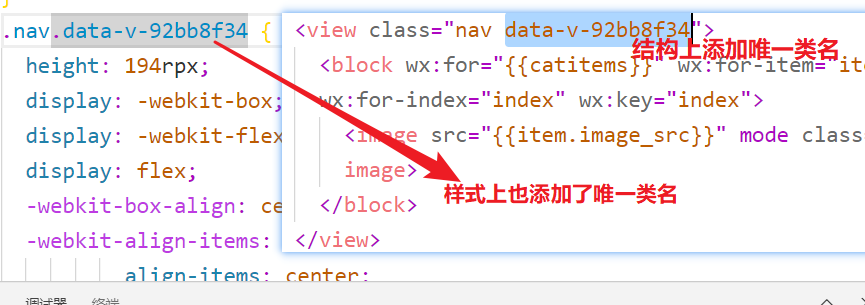
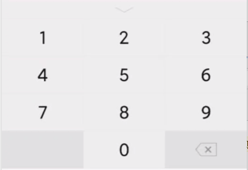
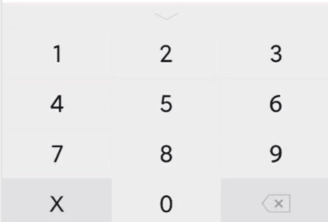

## day05

### 复习

完成首页结构 & 数据的渲染

+ 完成了静态页面
+ 在小程序中发送网络请求
+ 在 uniapp 中发送网络请求
+ 复习 promise

+ 使用 promise 结合 async & await 来完成网络请求的封装
+ 添加加载效果
  + 页面中央的加载效果： wx.showLoading()
  + 导航区域的加载效果：wx.showNavigationBarLoading()

完成分类页面的简单的布局：

+ 如果要设置元素的宽高，可以通过：
  + 给元素设置为固定&绝对定位
  + 给同一方向上的两个属性设置值： top & bottom，left & right
  + 将来元素的宽高就由这两个值之间距离来决定
+ 在这个过程中不能给元素设置宽高


### 今日内容

完成分类页面

完成搜索页面


### 补充 - 删除页面的 bug

**表现：**

+ 代码写完之后，总是会莫名其妙的报错

**原因：**

+ 我们在 HBuilderX 中新建页面时，HBuilderX 会帮助我们做两件事：
  + 在 `pages` 下创建一个 **.vue文件** & **文件夹**
  + 将新建的页面信息配置到 `pages.json` 中
+ 如果此时，我们直接将这个页面删除
  + 只会删除 `pages` 下创建的内容
  + 而 `pages.json` 中的配置信息没有删除，所以会报错

**解决方案：**

+ 删除页面时：
  + 先删除 `pages` 下的内容
  + 再删除 `pages.json` 中的配置
+ 重新运行项目


### 补充 - 首页其它布局的渲染方式

> 很多同学书写的结构跟课堂上写的结构完全不一样，结果在渲染时遇到了麻烦，我们来解决一下


### 分类 - 完成静态页面

**左侧：**

+ 点击时高亮显示 
+ 给元素设置高亮样式： `active`
+ 在 data 中保存当前选中选项的下标
  + `currentIndex: 0`
+ 在遍历生成左侧结构中动态绑定样式
  + `:class="{ active: index === currentIndex }"`
+ 给左侧中每个元素添加点击事件：
  + `@click="currentIndex = index"`

**右侧：**

+ 显示页面结构


### 分类 - 渲染页面

**步骤：**

+ 接口
  + url：https://www.uinav.com/api/public/v1/categories 

+ 发送请求，获取数据
  + onLoad 方法中，请求接口得到数据

+ 保存数据到 data 中

+ 渲染数据
  + 先渲染一级分类
    + categoryList每一项的cat_name
  + 再渲染二级分类
    + 右侧数据来自`categoryList[一级分类选中的下标].children`
    + 点击切换之后，重新得到当前一级下的二级数据


### 补充 - style要不要加scoped

+ scoped可以把样式限定在组件内，如何做到的？



+ uniapp页面style要不要加scoped？
  + 不需要
  + 因为页面样式是相互独立，不相互影响

+ **uniapp组件的style要不要加scoped？**
  + 需要
  + 引入组件不能影响当前页面的样式
  + 如果组件不加scoped，会被引入他的页面影响


### 语法 - 上拉加载更多 

> 需求：
>
> 1.0 打开页面时，默认会遍历一个数组：数组中有 20 条数据
>
> 2.0 向上滑动屏幕时，每次触底要多加载 10 条数据
>
> 3.0 当数据达到 50 条时，停止加载

[传送门](https://developers.weixin.qq.com/miniprogram/dev/reference/configuration/page.html)

**作用：**

+ 一般在分页场景里面，上拉时，把下一页数据追加到原来列表上

**步骤：**

+ 页面配置开启上拉
  + 页面内容超过页面的长度<50时，触发

    ```js
    "onReachBottomDistance":50
    ```

+ 触发上拉钩子函数`onReachBottom`
  
  + 在函数里面，下一页数据追加到原来列表上

**注意点：**

+ 分页场景里面，如果想触发上拉加载的话，保证一页列表长度大于一屏

+ uniapp里面下拉刷新和上拉加载更多的配置和方法与小程序一致的，只不过页面配置是在pages.json的style里面。


### 语法 - 下拉刷新

> 需求：
>
> 1.0 打开页面时，默认会遍历一个数组：数组中有 20 条数据
>
> 2.0 向上滑动屏幕时，每次触底要多加载 10 条数据
>
> 3.0 当数据达到 50 条时，停止加载
>
> 4.0 当下拉时，要更新数据，需要重新将数据回归到 20 条

[传送门](https://developers.weixin.qq.com/miniprogram/dev/reference/configuration/page.html)

**作用**

+ 一般在分页场景里面，下拉顶部有动画，清空原来的列表，展示第一页数据

**步骤：**

+ 页面配置开启下拉

  ```js
  {
    "enablePullDownRefresh":true, #开启下拉刷新
    "backgroundColor":"#009900", #窗口颜色，下拉后底色
    "backgroundTextStyle":"dark" #下拉loading点的颜色，默认light
  }
  ```

+ 下拉会触发方法`onPullDownRefresh`
  
  + 一般在这个方法里面：清空原来的列表，展示第一页数据
  
+ 提交结束下拉背景的显示：

  ```js
  wx.stopPullDownRefresh()
  ```

  


### 搜索列表 - 页面分析


1. 入口：点击三级分类跳转到搜索列表
2. 主要模块
   1. 搜索框，过滤栏，商品列表
3. 其他说明
   1. 过滤栏接口不支持
   2. 三级分类点击“曲面电视”，跳转到搜索列表，搜索框显示"曲面电视"
   3. 搜索框输入触发搜索，展示搜索列表
   4. 搜索列表下拉刷新和上拉加载更多


### 搜索列表 - 静态页面

**注意点：**

+ copy静态页面，并pages.json里面添加路径

+ App.vue公共样式需要copy

  ```css
  page{
      color:#333;
  }
  .text-line2{
      overflow: hidden;
      text-overflow: ellipsis;
      display: -webkit-box;
      -webkit-line-clamp: 2;
      -webkit-box-orient: vertical;
  }
  ```

  

### 搜索列表-过滤栏菜单切换


### 语法 - Input组件

**概念**

+ 输入框

+ 并不包括单选和多选框

**特性**

+ 没有边框，如果需要的话，用样式设置

+ type是键盘类型
  + 默认是text，文本键盘

    

  + number, 数字键盘

    

  + idcard， 身份证输入 、

    

  + confirm-type设置键盘右下角按钮的文字

    


+ 如何获取输入框的值

  + 小程序没有v-model

  + 通过事件来获取输入框的值

    + bindinput 输入时触发

    + bindblur 失去焦点时触发

      ```html
      <input type="text" value="文本键盘" bindinput="inputHandler"></input>
      ```

      ```js
      inputHandler(event){
      // 获取输入框的值
      console.log(event.detail.value)
      },
      ```

+ 点击键盘右下角按钮时触发的方法**bindconfirm**
  
  + 在模拟器里面，回车也可以触发bindconfirm


### 搜索列表 - 接口分析

+ url  https://www.uinav.com/api/public/v1/goods/search 

+ 方式 get

+ 参数
  + query  关键字
  + pagenum 当页码，从1开始的
  + pagesize 页容量


### 搜索列表-分类跳转搜索列表

+ 点击分类页面，三级分类跳转搜索列表
  + 点击@click:toSearchList
  + 跳转 uni.navigateTo

+ 传什么参数，传cat_name
  + 跳转url`?catName=`
  + 在模拟器页面参数检查传参是否正确
  + 添加编译模式，设置启动参数

+ 在搜索列表页面获取参数
  + onLoad

  

### 搜索列表-页面渲染

+ 发送请求
  + onLoad，请求方法queryGoodsList

+ 保存 data 属性，v-for渲染


### 搜索列表-下拉刷新

+ pages.json style里配置开启下拉

```json
"enablePullDownRefresh":true,
"backgroundColor":"#ccc",
"backgroundTextStyle":"dark"
```

+ 下拉会触发方法` onPullDownRefresh `
  
+ 方法和onLoad平级的
  
+ 方法里面逻辑
  + 请求第一页的数据，直接调queryGoodsList

  

### 搜索列表-上拉加载更多

+ pages.json style开启上拉

```json
"onReachBottomDistance":50
```

+ 触发对应钩子函数 onReachBottom 里面，加载下一页数据，追加
  + 页码+1，发请求

  + 页码pageNum作为data属性

  + 获取请求数据，不能直接赋值，**下一页数据需要追加在原列表上**

    ```js
    // 追加,不能直接赋值
    this.goodsList = [...this.goodsList, ...data.goods];
    ```

    

### 搜索列表-输入框输入触发搜索

+ 键盘右下角按钮文字 
  + confirm-type="search"

+ 点击键盘右下角按钮时，触发搜索
  + @confirm: search

+ search方法的逻辑，按输入框关键字进行搜索，搜索第一页，清空
  + 获取输入框关键字 v-model:keyword
  + 按输入框关键字进行搜索 queryGoodsList已经按钮keyword
  + 清空
  + this.goodsList=[]
  + 页码重置为1
  + 发现search逻辑和下拉刷新一样的，下拉刷新直接调用search

**注意点：**

+ 模拟器的输入框可能无法输入中文，预览手机扫码的话，没有问题。忽略掉。


### 搜索列表-最后一页不再发请求

**表现：**

+ 有一些请求返回数据空，已经到了最后一页，上拉时，还可以发请求

**解决思路：**

+ 到最后一页，就不再发请求

+ 判断是否已经到了最后一页
  
+ 对比列表长度和data.total
  
+ 解决方案
  + 设置data属性isLastPage

  + 在请求追加数据后，判断data.total<=this.goodsList.length

  + 在请求前，判断如果是最后一页的话，不发请求

    ```js
    // 如果已经是最后一页,阻止发请求 
    if(this.isLastPage){
        return 
    }
    ```

  + pageNum还会++，把最后一页不再发请求逻辑放在上拉钩子函数里面

    ```js
    // 上拉加载更多
    onReachBottom() {
        // 如果已经是最后一页,阻止发请求
        if (!this.isLastPage) {
            this.pageNum++;
            this.queryGoodsList();
        }
    }
    ```


### 真机调试