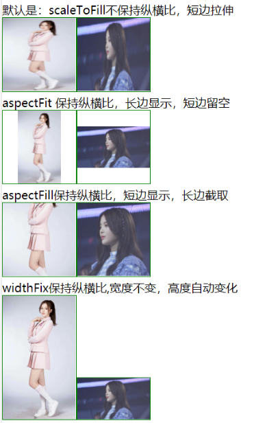
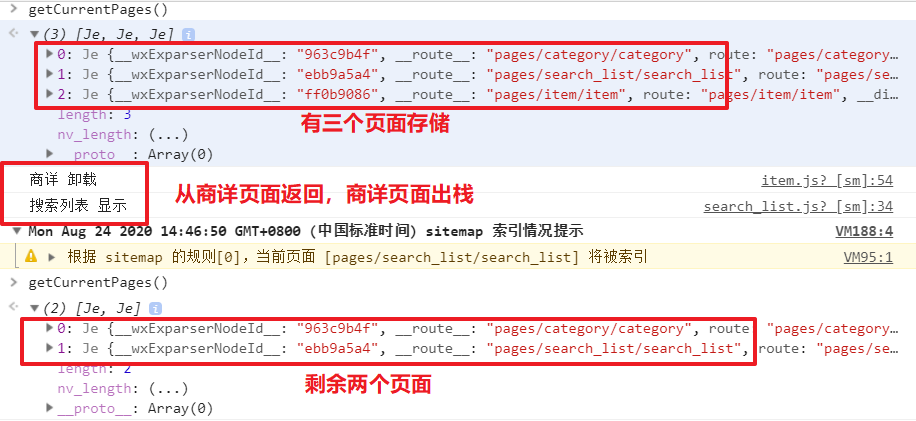

# day06

### 复习

补充：

+ uniapp 中删除页面之后小 bug
+ 首页中的其它布局方式

分类：

+ 静态页面

+ scoped 操作的原理：
  + 给当前组件中的所有元素设置一个单独的类名
  + 在设置样式时也会加上这个类名
+ 过滤菜单的结构
+ 渲染数据
+ 完成上拉加载更多
+ 完成下拉刷新
+ 判断数据加载完毕：
  + totla: unfined
  + arrList: []
  + if (total <= arrList.length) { // 说明数据加载完毕}

语法：

+ 上拉加载更多
  + 配置：onReachBottomDistance: 50
  + 设置方法：[onReachBottom](https://developers.weixin.qq.com/miniprogram/dev/reference/api/Page.html#onreachbottom)
+ 下拉刷新：
  + 配置：enablePullDownRefresh
  + 设置方法：[onPullDownRefresh](https://developers.weixin.qq.com/miniprogram/dev/reference/api/Page.html#onpulldownrefresh)
+ input：
  + 表现：
    + 没有边框，没有双向数据绑定
  + 事件：
    + confirm：点击回车触发的事件
    + input：输入内容时触发


### 今日内容

语法：

+ image 中的 mode 属性
+ 预览图片
+ 小程序生命周期：
  + App
  + page
+ 页面栈
+ 页面之间的跳转
+ 场景值
+ uniapp 的生命周期

改造 request.js 文件

完成搜索列表

完成商品详情页面


### 语法 - image mode属性

[传送门](https://developers.weixin.qq.com/miniprogram/dev/component/image.html)

图片裁剪、缩放的模式。

> 学习时可以类比于css background-size: cover,contain

+ scaleToFill不保持纵横比，短边拉伸
+ aspectFit 保持纵横比，长边显示，短边留空

+ aspectFill保持纵横比，短边显示，长边截取

+ widthFix保持纵横比,宽度不变，高度自动变化



**注意点：**

- 如果图片显示的区域的纵横比和原图片是一致，不管用什么模式都是一样的效果

+ 设计稿的图片宽高尽量要和后端返回的图片宽高的比例保持一致


### 语法 - 预览图片

> 小程序中提供了预览图片的方法：[wx.previewImage()](https://developers.weixin.qq.com/miniprogram/dev/api/media/image/wx.previewImage.html)

**作用：**

+ 在新页面中全屏预览图片。预览的过程中用户可以进行保存图片、发送给朋友等操作 

**用法：**

```js
wx.previewImage({
  current: '', // 当前显示图片的http链接
  urls: [] // 需要预览的图片http链接列表
})
```


### 语法 - 小程序App生命周期

> vue 的生命周期：
>
> > 流程：略
> >
> > 事件：beforeCreate & created  / beforemount & mounted / beforeUpdate & updated 
>
> 小程序分两个部分：
>
> > App：
> >
> > 页面：

[App生命周期](https://developers.weixin.qq.com/miniprogram/dev/reference/api/App.html)

**app生命周期可以理解成小程序本身**

+ onLaunch：启动小程序时会执行的事件  
  + 全局只会执行一次
  + 小程序初始化时执行一些逻辑放在这里

+  onShow ： 
  
  + 第一次打包 APP 进会执行
  + 切后台之后，再切回小程序也会执行
  + 后台切到前台需要更新小程序时用onShow
  
+ onHide
  + 小程序切后台会执行

  + 切后台时执行逻辑

    

### 语法 - 小程序Page生命周期

[Page生命周期](https://developers.weixin.qq.com/miniprogram/dev/framework/app-service/page-life-cycle.html)

**小程序页面的生命周期**

+ **onLoad**：页面加载 
  + 相当于created
  + 执行时机：页面初始化时
  + 应用场景：A跳转B，onLoad获取参数; **尽早发请求也应该在onLoad**

+ **onShow**：页面显示 
  + 相当于是actived
  + 执行时机：页面初始化时,B返回A时,A显示
  + 应用场景: B返A，A刷新界面

+ **onReady**：页面初次渲染完成 
  + 相当于是mounted
  + 执行时机：页面初始化时
  + 应用场景：没有遇到

+ **onHide**：页面隐藏 
  + 相当于是deactived
  + 执行时机：
    + A页面跳转B,A隐藏
  + 切后台
  + 应用场景：页面隐藏时，执行
  
+ **onUnload**：页面销毁 
  + 相当于destory
  + 执行时机：B返回A时，B销毁
  + 应用场景：B返回A时，清除定时器等。。。


### 语法 - 页面栈与页面跳转

[传送门](https://developers.weixin.qq.com/miniprogram/dev/framework/app-service/route.html) 

**页面栈**

+ 概念: 以栈的形式存储页面

+ 使用方法
  + `getCurrentPages`



+ 特点：
  + 如果跳转到路径都是非 `tabBar` ，那么页面栈会将所有的页面全部保存起来
    + 可以通过回退按钮来读取之前的页面（被回退的页面会销毁）
  + 如果跳转到 tabBar 页面会将所有的非 tabBar 页面全部 销毁

**页面跳转特点**：

+ 非tabbar的页面
  + 页面路径没有配置在tabBar里面的页面，不会有底部tab栏
  + **跳转非tabBar页面，用`wx.navigateTo`**
  + **A跳转B，B会入栈，A会隐藏(onHide)，B会初始化（onLoad,onShow,onReady）**
  + **B返回A时，B出栈，B销毁（onUnload）, A显示（onShow）**
  + 页面返回，点击导航栏左侧"<"和方法`  wx.navigateBack()`效果一样。

+ tabbar页面
  + tabbar页面一般是用来增加多入口，可能会被用户频繁使用，所以不会被销毁
  + **跳转到tabbar页面，用`wx.swtichTab`**
  + 小程序启动后，只会初始化第一个tabbar页面; 其他tabbar页面，第一次切换才会初始化
  + **tabbar只要初始化了，后续切换tabbar不会销毁，只会显示/隐藏（onShow/onHide）**
  + switchTab会销毁所有的非tabbar页面
  + 同一时间只有一个tabbar页面会入栈 


### 语法 - 场景值

[传送门](https://developers.weixin.qq.com/miniprogram/dev/reference/scene-list.html)

**概念**

+ 进入小程序方式的编程

**使用方法**

+ app.js

```js
/**
   * 当小程序启动，或从后台进入前台显示，会触发 onShow
   */
onShow: function (options) {
    console.log('app 显示')
    console.log(options.scene)
},
```

**作用**

+ 事件上报
  + pv/uv
  + pv是指页面一天被访问的量
  + uv是指页面一天被多少人访问


### 语法 - uniapp生命周期

[uniapp的生命周期](https://uniapp.dcloud.io/collocation/frame/lifecycle)

+ uniapp应用生命周期和小程序一致
  + onLaunch,onShow,onHide

+ uniapp页面生命周期和小程序一致
  + onLoad,onShow,onReady,onHide,onUnload

+ uniapp组件生命周期和Vue标准组件一致
  + created, mounted


### 语法 - onPageScroll

> [onPageScroll](https://developers.weixin.qq.com/miniprogram/dev/reference/api/Page.html#onPageScroll-Object-object)

**作用：**

+ 在小程序中页面滚动是会触发这个事件
+ 参数：
  + scroll.scrollTop：用来得到页面滚动的距离


### 改造 request - 传入一个对象

> 需求：默认情况下调用 $http 方法时，需要传入的是一个 url 路径，把路径中的参数单独放到一个 data 中

步骤：

+  在 `request.js` 中给方法添加一个参数 `data`
+ 请求时携带参数


### 改造 request - 请求不需要loading

>  需求：默认请求开启loading，如果不需要loading，希望this.$request传参不需要loading

**步骤：**

+ 搜索列表请求的this.$http传参`hasLoading:false`

+ 公共的请求方法，判断hasLoadin为true，开启Loading

+ 对参数对象进行解构

  ```js
  function request({url, data, method}) {}
  ```

+ 能否默认hasLoading==true

  ```js
  function request({
  	url,
  	data,
  	// 默认开启loading
  	hasLoading = true
  }) {
  ```

  


### 搜索列表 - 请求中就不再发请求

> 需求：如果请求没有回来之前，就不再发请求

**步骤：**

+ data属性: isRequesting 是否在请求中

+ 请求前，如果有其他请求正在处理，等待

+ 请求开始前，设置为请求中

+ 请求结束后，设置为请求结束

```js
// 请求前,如果有请求正在处理,等待
if (this.isRequesting) {
    return;
}
// 请求开始前,设置请求中
this.isRequesting = true;

//请求的逻辑

// 请求结束后,设置不要请求中
this.isRequesting = false;
```


### 搜索列表 - 搜索和过滤栏固定


> 需求：上拉时输入框和过滤栏固定

**步骤：**

+ 把输入框+过滤栏设置position:fixed
  + 并且调.list的margin-top: 220rpx
+ 判断：
  + 当滚动条在最上方时， `输入框+过滤栏`：应该是静态定位： `static`
+ 当滚动条只在不在最上方时，`输入框+过滤栏`:应该是固定定位： `fixed`


### 搜索列表-搜索和过滤栏固定（sticky定位）

+ position:sticky
  + 相对它的*最近滚动祖先* 
  + 定位,top,left,right,bottom

+ 步骤

  ```css
  .top-header {
  	position: sticky;
  	top:0;
  	left:0;
  	right:0;
  	background-color: #fff;
  }
  ```

**注意点：**

+ position:sticky在h5里面兼容性不好。 


### 商品详情-静态页面

+ copy item静态页面

+ pages.json添加路径

+ iconfont网站生成icon的cdn链接，copy内容

+ 新建/css/iconfont.css, 粘贴以上的内容

+ App.vue引入iconfont.css

  ```css
  <style>
  /*每个页面公共css */
  @import url("./css/iconfont.css");
  </style>
  ```

+ 页面使用

  ```css
  <text class="iconfont 图标的类名"></text>
  ```

**注意点**

+ 样式的引入不建议在 main.js 引入


### 商品详情-页面分析

+ 入口：搜索列表点击具体的商品跳转到商详

+ 主要模块：
  + 轮播图，基本信息，图文介绍，联系客服，购物车，加入购物车，立即购买

+ 其他说明
  + 接口不支持运费，促销信息，还有商品规格。

​	

### 商品详情-页面渲染

+ 搜索列表点击具体的商品跳转到商详,并传递goods_id
  + 点击@click: toItem
  + 跳转wx.navigateTo, url上拼接goodsId
  + 页面参数检验传参是否正确
  + 添加编译模式，设置启动参数为"goodsId=495"

+ 在商详页面onLoad获取goodsId
  + 接口：https://www.uinav.com/api/public/v1/goods/detail?goods_id=57396 

  + 需要参数goods_id

+ 尽量发请求
  + onLoad
  + 请求方法queryGoodsDetail

+ 请求数据赋值给data属性，goods

+ 在页面渲染即可
  + 轮播图，价格和名称


### 商品详情-轮播图预览图片

**预览图片API**

+ 小程序API：wx.previewImage 

  ```js
  wx.previewImage({
    current: '', // 当前显示图片的http链接
    urls: [] // 需要预览的图片http链接列表
  })
  ```

+ uniapp：uni.previewImage

  ```js
  uni.previewImage({
    current: stirng/number, // 当前显示图片的http链接,或者下标
    urls: [] // 需要预览的图片http链接列表
  })
  ```

**步骤：**

+ 轮播图片上注册点击事件
  + @click:prevImg

+ prevImg里面逻辑，使用`uni.previewImage`
  + 传参urls预览图片数据

  + urls需要根据原数组构造
  + current传了点击下标

+ 优化
  + urls构造使用数组map 