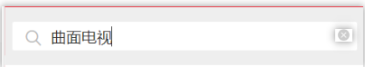
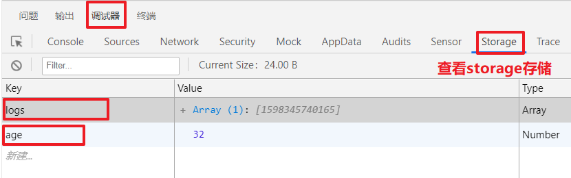

## day07

### 复习

语法：

+ image

  + mode：设置图片的模式 14种

+ 预览图片：

  + wx.previewImage()

+ 小程序的应用生命周期：

  + onLaunch
  + onShow
  + onHide

+ 小程序的页面生命周期：

  + onLoad
  + onShow
  + onReady
  + onHide
  + onUnload
    + 页面卸载时会触发

+ 页面栈：

  + 在小程序中页面之间进行跳转时小程序会将之前的页面进行保存，保存的结构叫做页面栈，页面栈最多 10 层

+ 页面的跳转

  + 非 tabBar 页面
    + 在跳转时会将跳转的页面保存到页面栈中
    + 如果回退会将回退之前的页面卸载
  + tabBar 页面
    + 可以使用 wx.switchTab 进行跳转
    + 跳转之后会自动清除页面栈中所有非 tabBar 页面

+ 场景值

  + 进入小程序方式的编号

+ uni-app 的生命周期

  + 支持小程序中的应用生命周期
    + 必须写在 App.vue
  + 支持小程序中的页面生命周期
  + 支持 vue 中的生命周期

+ 改造 request.js 文件：

  + 将参数改为一个对象
  + 将参数进行解构，给 hasLoading 赋一个默认值

+ 搜索列表：

  + 响应没有回来之前，不会发送第二次请求

  + 将搜索和过滤栏固定

+ 商品详情

  + 静态页面


### 今日内容

+ 商品详情：
  + 完成数据的渲染
+ 搜索列表页面：
  + 防抖
  + 节流


### 商品详情-页面渲染

+ 搜索列表点击具体的商品跳转到商详,并传递goods_id
  + 点击@click: toItem
  + 跳转wx.navigateTo, url上拼接goodsId
  + 页面参数检验传参是否正确
  + 添加编译模式，设置启动参数为"goodsId=495"

+ 在商详页面onLoad获取goodsId
  + 接口：https://www.uinav.com/api/public/v1/goods/detail?goods_id=57396 

  + 需要参数goods_id

+ 尽量早发请求
  + onLoad

+ 请求数据赋值给data属性，goods

+ 在页面渲染即可
  + 轮播图，价格和名称


### 商品详情-轮播图预览图片

**预览图片API**

+ 小程序API：wx.previewImage 

  ```js
  wx.previewImage({
    current: '', // 当前显示图片的http链接
    urls: [] // 需要预览的图片http链接列表
  })
  ```

+ uniapp：uni.previewImage

  ```js
  uni.previewImage({
    current: stirng/number, // 当前显示图片的http链接,或者下标
    urls: [] // 需要预览的图片http链接列表
  })
  ```

**步骤：**

+ 轮播图片上注册点击事件
  + @click:prevImg

+ prevImg里面逻辑，使用`uni.previewImage`
  + 传参urls预览图片数据

  + urls需要根据原数组构造
  + current传了点击下标

+ 优化
  + urls构造使用数组map


### 商品详情-图文介绍和规格

+ 渲染图文介绍

```html
<!-- <view v-html="goods.goods_introduce">图文介绍</view> -->
<rich-text :nodes="goods.goods_introduce"></rich-text>
```

**注意点：**

+ rich-text组件只支持部分html标签

+ 一般商详图文介绍，基本上都用图片。特别适合用rich-text


### api-小程序分享功能

**右上角菜单“转发”按钮的行为**

> [onShareAppMessage](https://developers.weixin.qq.com/miniprogram/dev/reference/api/Page.html#onShareAppMessage-Object-object)

```js
// 声明onShareAppMessage
onShareAppMessage(){
    // 定制分享弹窗
    return{
        title:'弹窗标题',
        // path: //分享后，别人点击时去到的路径。默认是当前页面
        imageUrl:this.goods.pics[0].pics_big //自定义图片
    }
},
```

**页面内分享**

> [传送门](https://developers.weixin.qq.com/miniprogram/dev/framework/open-ability/share.html)

+ 声明button

  ```html
  <button open-type="share"></button>
  ```

+ 声明onShareAppMessage

  ```js
  // 声明onShareAppMessage
  onShareAppMessage(){
      // 定制分享弹窗
      return{
          title:'弹窗标题',
          // path: //分享后，别人点击时去到的路径。默认是当前页面
          imageUrl:this.goods.pics[0].pics_big //自定义图片
      }
  },
  ```

  


### 商品详情-分享的功能

+ 需要支持右上角转发
  + 函数和onLoad是平级的

    ```js
    // 声明onShareAppMessage
    onShareAppMessage(){
        // 定制分享弹窗
        return{
            title:'弹窗标题',
            // path: //分享后，别人点击时去到的路径。默认是当前页面
            imageUrl:this.goods.pics[0].pics_big //自定义图片
        }
    },
    ```

+ 页面内分享
  + 声明button

    ```html
    <button open-type="share">
        分享
    </button>
    ```

+ 如何不影响原来的样式，并且有分享功能
  + **样式覆盖原来的元素，并且透明**

    ```css
    button{
        position: absolute;
        opacity: 0;
    }
    ```

    

### 商品详情-客服功能

+ 声明button

  ```html
  <button open-type="contact">客服</button>
  ```

+ button**样式覆盖原来的元素，并且透明**

+ TODO：需要后端接入客服系统

**补充：**

+ 客服系统
  + 用户：先和机器人聊，输入"人工"，排队和人工客服聊
  + 后台：会挑选一个人工客服去接待

+ 特点：很多公司都需要客服系统，而且客服系统功能是固定。所以市场肯定有卖这个功能的，价格便宜。所以一般公司不会自己开发

+ 结论：客服系统已经集成腾讯云


### Vue组件通信-父传子

+ 父使用子组件所在的dom上，传属性

  ```html
  <child msg="不要早恋" parent-msg="牙膏不要从中间挤"></child>
  ```

+ 子组件声明props就可以传值，在结构使用时，和data属性一样

    ```js
    Vue.component('child', {
        template: '#tpl',
        props: ['msg','parentMsg']
    })
    ```

    ```html
    <div class="child">
        <h2>我是子组件</h2>
        <h4>父对子说:{{msg}}</h4>
        <h4>父对子说:{{parentMsg}}</h4>
    </div>
    ```


### Vue组件通信-父传子动态

+ 子如果想改父props, 报错了，如何解决
  
+ 把prop作为data属性的初始值
  
+ 父改属性，子无感知
  + 侦听父传的属性
    ```js
    Vue.component('child', {
        template: '#tpl',
        props: ['msg'],
        data () {
            return {
                //把prop作为data属性的初始值
                myMsg: this.msg
            }
        },
        // 侦听data属性，计算属性，props
        watch: {
            // 父props有变化时，再设置给子data属性
            msg (newValue) {
                this.myMsg = newValue
            }
        }
    })
    ```
    


### Vue组件通信-子传父

+ 子组件传消息出去

    ```js
    this.$emit('child-event','不要抽烟')
    ```


+ 在父组件获取消息

    ```html
    <child @child-event="getMsg"></child>
    ```

   ```js
   getMsg(data){
       // data就是子传给父的消息
       console.log(data)
   }
   ```


### 搜索列表-抽取头部输入框为单独的组件

> 抽取的原因
>
> > 搜索列表和搜索页面搜索框设计都不好
> >
> > 统一换成这样
> >
> > 
> >
> > 复习父子组件传参

**步骤：**

+ 添加 SearchCom.vue 组件
+ 在searchlist.vue页面使用组件
  + 引入组件
  + 注册组件
  + 组件名当标签使用


### 搜索列表-输入框触发搜索

> 需求：子组件点击键盘右下角搜索时，触发父组件，父组件按输入框的关键字进行搜索

+ 子组件SearchCom

  + 点击键盘右下角搜索

    + @confirm: confirmHandler

  + confirmHandler逻辑, $emit事件，并且传输入框的值

  + 如果输入框的内容为空，不触发

    ```js
    this.$emit('search',this.inputVal)
    ```

+ 父组件search_lists

  + 在使用子组件的所在的dom上注册@search: search
  + 在search里面获取子传父的输入框的内容，赋值给keyword,再发请求
  + 修改search方法后，因为search方法同时下拉刷新也会用，稍作调整


### 搜索列表-SearchCom的基本功能

+ SearchCom组件，设置输入框键盘右下角文字为搜索

    ```html
    confirm-type="search"
    ```

+ x按钮有内容就显示，没内容就不显示

   + 获取内容data.inputVal,使用v-model
   + inputVal配置v-show在dom里控制x按钮显示

+ 点击x按钮时，清空输入框的内容

   + 点击@click="inputVal=''"


### 搜索列表-输入框初始值

> 需求：search_list有keyword应该设置给子组件input框

**步骤**

+ 父使用子组件所在的dom传属性

   ```html
   <SearchCom :keyword="keyword"></SearchCom>
   ```

+ 子组件声明props

   ```js
   props:['keyword']
   ```

+ 符合单向数据流，避免修改子组件prop

   ```js
   data(){
   	return{
          //prop赋值给data属性，避免子改父prop
   		inputVal: this.keyword
       }
   }
   ```

+ 第3步存在问题：输入框值还是空的。

   + 原因：**父组件onLoad执行时机晚于子组件data函数**
   + 解决方案：
      + 侦听子组件prop，有变化时prop设置给data.inputVal

       ```js
       watch:{
            keyword(newValue){
                // 父组件onLoad改变keyword,子组件prop变化后,再设置给data.inputVal 
                this.inputVal = newValue
            }
        }
       ```


### 搜索页面-页面分析&静态页面


+ 入口：首页和分类点击搜索热区跳转到搜索页面

+ 主要模块
  
+ 搜索框，历史搜索列表
  
+ 其他说明
  + 搜索框也是用SearchCom.vue
  + 搜索框输入内容，跳转到搜索列表页面，并按内容进行搜索展示列表
  + 历史搜索列表点击某一项，也会跳转到搜索列表页面，进行搜索
  + 第2，3，搜索关键字会插入到历史搜索列表头部
  + 历史搜索会存储在storage

  

### 搜索页面-跳转搜索列表页面

+ 首页和分类点击搜索热区跳转到搜索页面
   + 搜索热区这个组件内，点击跳转
+ 输入内容，点击键盘右下角按钮时跳转搜索列表页面
   + 子组件SearchCom已有功能，输入内容，点击键盘右下角按钮，会$emit事件“search”
   + 父组件search.vue注册@search事件，然后跳转搜索列表页面
      + @search:toSearchList
      + toSearchList逻辑，跳转到搜索列表页面


### 搜索页面-跳转搜索列表页面并触发搜索

> 需求：在搜索页面输入框输入关键字，跳转搜索列表页面时按关键字进行搜索 


### api - 数据缓存

[传送门](https://developers.weixin.qq.com/miniprogram/dev/api/storage/wx.setStorageSync.html)

**作用：**

+ 小程序本地缓存

**回顾localStorage与sessionStorage**

+ 如何使用

   ```js
   localStorage.setItem('name','joven')//存
   localStorage.getItem('name')//取
   localStorage.removeItem('name')//移走指定key的本地存储
   localStorage.clear() //清除所有
   ```

+ sessionStorage关闭页面后存储就没有了

+ 缺点：存储最大空间是5M,太小了

**API的使用**

> localStorage & sessionStorage 只能字符串
>
> Storage：啥都能存

+ 建议直接使用同步的API，也就是带"sync"的API

```js
// 存名字
wx.setStorage({
    data: 'joven',
    key: 'name',
    success(){
        console.log('存成功了')
    }
})
console.log('下一句')
//存年龄
wx.setStorageSync('age', 32)
// 取名字
console.log( wx.getStorageSync('name'))
//当前storage的相关信息
console.log( wx.getStorageInfoSync())

//移走指定key的存储
wx.removeStorageSync('name')
//清除所有的存储
wx.clearStorageSync()
```

**注意点：**

+ 在微信开发者工具，调试器可以查看到当前的存储状态




### 搜索页面-历史搜索列表展示

+ 先在storage存一些历史搜索关键字

   ```js
   wx.setStorageSync('history',['小米','华为','vivo','oppo'])
   ```

+ 在data属性history初始化时

   + storage=>data属性

+ data属性渲染dom

**注意点:**

+ storage=>data属性=>界面


### 搜索页面-添加搜索关键字

> 输入框内输入关键字，关键字应该加到历史搜索列表的头部并去重

**步骤：**

+ 关键字应该插入到history数组头部，并且去重

+ 历史搜索改变应该存储到storage

```js
//关键字应该插入到history数组头部，并且去重
// this.history.unshift(inputVal);
//或者用以下...展开运算符也行
this.history = [inputVal,...this.history]
this.history = [...new Set(this.history)];
// 历史搜索改变应该存储到storage
uni.setStorageSync(HISTORY_KEY, this.history);
```


### 搜索页面 - 联想功能

> 需求：在输入框中输入内容时，输入框底部会显示与输入内容相关的信息

**步骤：**

+ 完成将联想内容的 html 结构
+ 动态得到联想结构中的数据源
  + 先给输入框中添加一个事件： input 
  + 每次触发时，应该发送请求到服务器，得到关键字对应的联想数据
  + 将数据保存起来，并且渲染到页面上
  + 判断：
    + 如果联想数据 的长度为 0 就不显示联想结构
    + 如果联想数据的长度不为0 就显示联想结构


### 搜索页面 - 联想关键字高亮

> 需求：联想出来的数据中的关键字应该高亮显示

**步骤：**

+ 得到数据之后遍历联想的数据
  + 将每条数据的 goods_name 进行处理：
    + 将 goods_name 中的关键字使用 `<span style="color: red">${关键字}</span>` 进行替换
    + 将替换的结果返回为一个新的数组
+ 重新在页面上进行遍历：
  + 遍历时使用 `<rich-text :nodes="item"></rich-text>`


### 搜索页面 - 点击联想选项跳转

> 需求：点击联想的选项之后，应该跳转到搜索列表页面

**步骤：**

+ 得到数据之后遍历联想的数据

  + 将每条数据的 goods_name 进行处理：

    + 由于之后已经返回了带有 span 的结构，所以这次需要返回一个对象

      ```js
      {
      	newItem: '70迈<span style=\"color: red\">小米</span>行车记录仪智能后视镜导航行车记录仪云镜测速一体机',
      	oldItem: '70迈小米行车记录仪智能后视镜导航行车记录仪云镜测速一体机'
      }
      ```

+ 重新在页面上进行遍历

  ```html
  <view class="think">
      <view class="item" @click="toSearchList(item.oldItem)" v-for="(item, index) in tinkList" :key="index">
     		<rich-text :nodes="item.newItem"></rich-text>
      </view>
  </view>
  ```

  

### 防抖与节流 - 抖动

**概念：**

+ 在 input 输入框中绑定 input 事件，每次输入内容时都要触发一次事件
+ 而多次事件中只有一次是我们需要的
+ 其它的次我们称之为抖动

**场景：**

+  input 绑定 input 事件
+ 窗口绑定滚动事件
+ 窗口大小的改变事件
+ 鼠标的移动事件
+ ...


### 防抖与节流 - 防抖

> 由于抖动对系统性能消耗比较大，所以需要解决这个问题，解决方式有两种：
>
> > 防抖
> >
> > 节流

**特点：**

+ 当持续触发事件时，不执行逻辑代码
+ 当触发停止时，过一段时间再执行逻辑代码

**代码：**

+ 原生：

  ```js
      var timer = null
      window.onscroll = function () { // 12 次连接执行
          // 每次进来之前，将之前的定时器清除掉
          clearTimeout(timer)
          timer = setTimeout(() => {
              console.log('onscroll')
          }, 1000);
      }
  ```

+ 函数：

  ```js
      // 方法：防抖
      function fangdou(time, callback) {
          // 定义一个定时器
          var timer = null
          return function () {
              clearTimeout(timer) // 在一个作用域中访问另一个作用域中的变量：构成了闭包（面试题：说说你在实际开发中闭包的使用场景）
              timer = setTimeout(() => {
                  // console.log('onscroll')
                  callback()
              }, time);
          }
      }
  
      // 给窗口添加滚动事件
      window.onscroll = fangdou(1000, () => {
          console.log('onscroll')
      })
  ```

  

### 防抖与节流 - 节流

**特点：**

+ 当持续触发事件时，每隔固定时间也会执行一次逻辑代码
+ 当触发停止时，过一段时间再执行逻辑代码

**代码：**

+ 原生：

  ```js
      // 创建一个开始时间
      var beginTime = Date.now()
      // 定义一个定时器
      var timer = null
      // 给窗口添加滚动事件
      window.onscroll = function () { // 1000 次（连续执行的）
          // 清除定时器
          clearTimeout(timer)
          // 得到当前时间
          var currentTime = Date.now()
          // 得到一个时间间隔
          var space = currentTime - beginTime
          // 如果时间间隔大于 1000 ,就执行逻辑
          if (space > 1000) {
              console.log('onscroll')
              // 由于上一次已经执行完成，开始时间应该变为现在的时间
              beginTime = Date.now()
          } else {
              timer = setTimeout(() => {
                  console.log('onscroll')
              }, 1000);
          }
      }
  ```

  

+ 函数：

  ```js
  // 节流的方法
      function jieliu(time, cb) {
          var timer = null
          var beginTime = Date.now()
          return function () {
              clearTimeout(timer)
              if (Date.now() - beginTime > time) {
                  cb()
                  beginTime = Date.now()
              } else {
                  timer = setTimeout(() => {
                      cb()
                  }, time);
              }
          }
      }
  ```

  

### 搜索页面 - 使用防抖解决联想的 bug

**bug 的表现：**

+ 每次在输入框中输入内容都要发送请求
+ 有很多请求是不必要的

**bug 的原因：**

+ 我们给 input 绑定的时 input 事件，所以每次都会触发

**解决方案：**

+ 使用防抖来解决 bug

**代码：**

```js
            // 在 data 中定义定时器
            timer: null

			// 修改联想方法
			thinkList(value) {
				// 设置一个防抖
				clearTimeout(this.timer)
				this.timer = setTimeout(async () => {
					// console.log(value) // value 输入框中的内容
					// 根据 value 关键字，得到服务器中对应的商品数据
					var res = await this.$http({
						url: 'https://www.uinav.com/api/public/v1/goods/search',
						data: {
							query: value,
							pagenum: 1,
							pagesize: 10
						}
					})
					this.tinkList = res.goods.map(item => {
						return {
							newItem: item.goods_name.replace(value, `<span style="color: red">${value}</span>`),
							oldItem: item.goods_name
						}
					})
				}, 500)
			},
```

