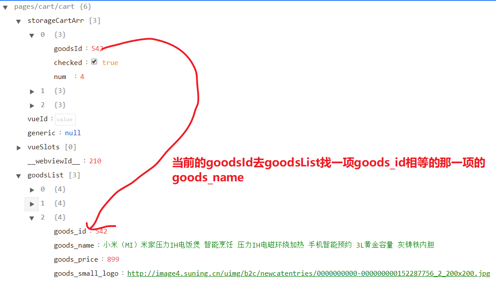

## day08

### 复习

商品详情：

+ 渲染页面数据
+ 分享功能
+ 联系客服

复习 - 组件之间的传递

+ 父传子
+ 子传父

搜索列表

+ 头部搜索结果封装为单独的组件

搜索页面

+ 静态页面
+ 进行搜索
+ 缓存数据：
  + storage
    + 特点：
      + 相当于浏览器中的 localstorage
      + 它里面什么类型的数据都可以存
    + 方法：
      + getStorage
      + getStorageSync
      + setStorage
      + setStorageSync
      + removeStorage
      + removeStorageSync
+ 搜索数据的渲染
+ 添加搜索关键字

防抖与节流：

+ 防抖：
  + 特点：
    + 持续触发事件时，不会执行逻辑代码
    + 事件停止触发时，才会执行逻辑代码
+ 节流：
  + 特点：
    + 持续触发事件时，每隔一段时，也会执行逻辑代码
    + 事件停止触发时，也执行一次逻辑代码


### 今日内容

完善搜索页面

完成购物车页面


### 补充 - 解决 bug1

**表现:**

+ `this.historyList.unshift`  is no a function

**原因：**

+ 如果 `storage` 中默认没有数据，打开页面时，在 `onLoad` 中执行的 `this.historyList = uni.getStorageSync('history')` 得不到数据
+ 当向 `historyList` 中添加数据时，就会报错

**解决方案：**

+ `this.historyList = uni.getStorageSync('history') || []`


### 补充 - 解决 bug2

**表现：**

+ 在输入框中输入内容，点击跳转到搜索列表页面，再回退到搜索页面时，联想内容依旧存在

**原因：**

+ 在小程序的页面栈中保存了上一个页面的所有信息

**解决方案:**

+ 重新打开页面时，应该将之前的联想信息清除掉


### 搜索页面-点击历史搜索

> 需求：点击历史搜索列表里面每一项，跳转搜索列表页面，按这一项的文字进行搜索。并且这一项文字插入到历史执行列表的头部并去重

**步骤：**

+ 根据需求分析，逻辑很像toSearchList

+ **直接用toSearchList(这一项的文字)**


### 搜索页面-清空历史搜索

> 需求：点击历史搜索x按钮，弹框提示，如果确定的话，清除对应的storage并且清空界面

**步骤：**

+ 点击x，弹框提示
  + 是否清空历史
  + 弹框 uni.showModal
    + res.confirm为true表示用户确定的
  + 清除对应的storage并且清空界面
    + this.history=[]
    + `uni.removeStorageSync`


### 计算属性 - getter & setter

> [传送门](https://cn.vuejs.org/v2/guide/computed.html#%E8%AE%A1%E7%AE%97%E5%B1%9E%E6%80%A7%E7%9A%84-setter)

**计算属性getter**

+ 计算属性里面get方法

+ 当结构有对data属性有复杂的计算时，就需要用到计算属性

+ 计算属性名当方法名这个写法是简写，完整的对写计算属性名应该是一个对象

```js
 computed: {
     // getter的简写
     // fullName(){
     //   return this.firstName+' '+this.lastName
     // }
     // 完整写法
     fullName: {
         // 当结构中使用读fullName，找到计算属性fullName的get方法
         get () {
             return this.firstName + ' ' + this.lastName
         }
     }
 }
```

**计算属性setter**

+ set方法

+ 当改变计算属性时，需要提供set方法
  + 一般在set里面把改变后的值设置给它的依赖

+ 如果需要set方法时，一定要完整写法

+ 应用场景：全选逻辑

```js
computed: {
    fullName: {
        set(newVal){
            // newVal就是fullName改变后的值
            console.log(newVal)
            // 一般在set里面把改变后的值设置给它的依赖
            //sam wang
            let arr = newVal.split(' ')
            this.firstName = arr[0]
            this.lastName = arr[1]
        }
    }
}
```


### 计算属性 - setter与全选逻辑

```js
computed: {
    isAll: {
        get () {
            // 所有技能都选中isAll选中
            return this.isjs && this.iscss && this.isVue
        },
        set(status){
            console.log(status)
            // 保持技能的选中状态和status一样
            this.isjs = status
            this.iscss = status
            this.isVue = status
         }
    }
}
```


### 购物车-页面分析

+ 入口: 点击底部tab菜单购物车跳转购物车页面; 商详点击购物车跳转购物车页面

+ 主要模块：

  + 商品列表，每一项包括：商品名称+价格+图片+勾选状态+数量

  + 全选+总价格+总数量

+ 其他说明
  + 顶部的收货地址功能移到支付页面
  + 只有勾选的商品才会参与订单，而且可以修改商品数量

  

### 购物车 - 静态页面


### 购物车 - 商详跳转购物车

**步骤：**

+ 给详情页面的购物车添加点击事件

+ 在点击事件中跳转到购物车中


### 购物车-接口分析

> 接口url：  https://api-ugo-dev.itheima.net/api/public/v1/goods/goodslist?goods_ids=140,395,495 

+ 购物车添加商品id以逗号分隔，作为请求参数

+ 请求返回数据包括
  + 商品id
  + 商品名称
  + 商品价格
  + 商品图片

+ 实际上购物车商品列表每一项应该包括
  + 商品名称
  + 商品价格
  + 商品图片
  + 勾选状态
  + 数量

+ 问题：**商品id+勾选状态+数量来自于哪里呢？**
  + 只能存在storage
  + 请求返回的数组是无序的，并不是和传参ids顺序致


### 购物车 - 数据存储结构

> 商品id+勾选状态+数量需要存储在storage，数据结构怎么样呢？

1. 数组
   1. 有序的
   2. 取值不方便
2. 对象
   1. 无序的
   2. 取值方便

```js
//数组
let cartArr =[
    {
        goodsId:495,
       	checked:true,
        num:  
    },
    {
        goodsId:140,
       	checked:false,
        num:3
    },
    ....
]

//对象
let cartObj={
    '495':{
        checked:true,
        num:1
    },
    '140':{
        checked:false,
        num:3
    }
}
```


### 加入购物车-对象方式

+ 给点击加入购物车绑定事件
+ 在事件中
  + 得到 `storage`
  + 更新
    + 首次添加
      + num:1
      + checked:true
    + 非首次添加
      + num+1
      + checked:true
    + 如何判断是否是首次添加呢？
      + 判断`cartObj[当前商品id]`是否为undefined
  + 重新保存 `storage`
  + 提示加入购物车成功

**注意点：**

+ 只要加入购物车，商品勾选状态始终为true


### 加入购物车 - 数组的方式

+ 取storage

+ 更新购物车中的数据
  + 首次添加，num:1, checked:true

  + 非首次添加,num+1， checked:true
  + 如果是数组应该如何判断是否是第一次
    + find
    + 存storage


### 购物车-非首次添加优化

**步骤：**

+ 非首次添加对象，也需要插入到头部

+ 方案

  ```js
  // 插入到头部并去重
  cartArr.unshift(targetGoods);
  cartArr = [...new Set(cartArr)]
  ```

+ findIndex 得到下标
  
  + 先删除再头部插入

**注意点：**

+ 可以在加入购物车时，把商品名称，价格和图片全部存储吗？
  + storage存储尽量小，越小越好
  + 商详页面商品图片不适合在购物车中展示


### 购物车-渲染选中状态及数量

> 接口返回的数组并不是按传参goodsId的顺序

+ 请求参数商品Id以逗号分隔

+ 取storage cart里面每一项的goodsId拼接

  + 推荐用map结合join

    ```js
    let goodsIdArr = this.storageCartArr.map(item=>{
        return item.goodsId
    })
    
    let idStr = goodsIdArr.join(',')
    ```

    

+ 发请求，返回数据
  + 尽早发请求在onShow，而且切换tab时，也可以刷新页面
  + 可以返回数据，但是数组并不是有序，所以无法在结构中遍历

+ storage cart 数据作为data属性，渲染
  + checkbox渲染，就是添加icon的样式

    ```js
    <text class="iconfont" :class="item.checked?'icon-checked':'icon-unchecked'"></text>
    ```

    

### 购物车-渲染商品名称价格及图片

**问题：**

+ 商品名称如何渲染



**解决方案：**

+ 把storageCartArr和goodsList数据进行合并，合并以storageCartArr为主，因为它是有序的
  + storageGoods.goodsId去_goodsList里面找一项goods_id相等那一项, storageGoods和找到的对象进行合并成一个新的对象

  + 用map把合并到的对象返回作为新数组的每一项。

    ```js
    // storageCartArr和_goodsList合并,以storageCartArr为主
    this.goodsList = this.storageCartArr.map(storageGoods => {
        // storageGoods.goodsId去_goodsList里面找一项goods_id相等那一项, storageGoods和找到的对象进行合并成一个新的对象
        let targetGoods = _goodsList.find(item => {
            return item.goods_id === storageGoods.goodsId;
        });
        // 注意点,这里是对象
        return { ...storageGoods, ...targetGoods };
    });js
    ```

+ 用goodsList渲染页面


### 购物车-商品勾选与不勾选

+ 点击每一个商品时，item.checked取反


### 购物车-商品跳转商详

点击每个商品，跳转商详，并传参goodsId


### 购物车 - 购物车中的数据存哪里

> 描述
>
> > 如果手机京东上，加入商品到购物车，在PC端打开京东网站，这个商品是否添加了？是的
> >
> > 如果京东网站，无没登录前加入购物车，再登录的话，这个商品是否在购物车？是的

+ 方案
  + 购物车据据存vuex：
    + 仅仅使用vuex不行，刷新就没有
  + 购物车数据存在storage：
    + 仅仅使用storage也不行

+ 购物车数据发请求
  + 登录前后购物车数据同步关键在于clientId,是设备的唯一标识

> 实际工作中，请求一般在100ms以内


