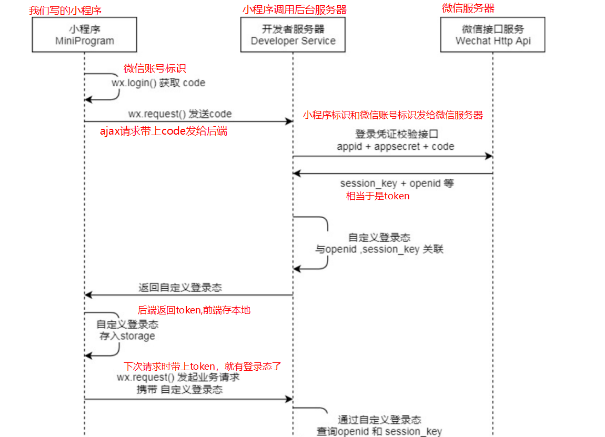
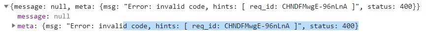
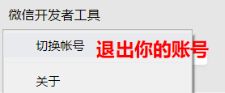
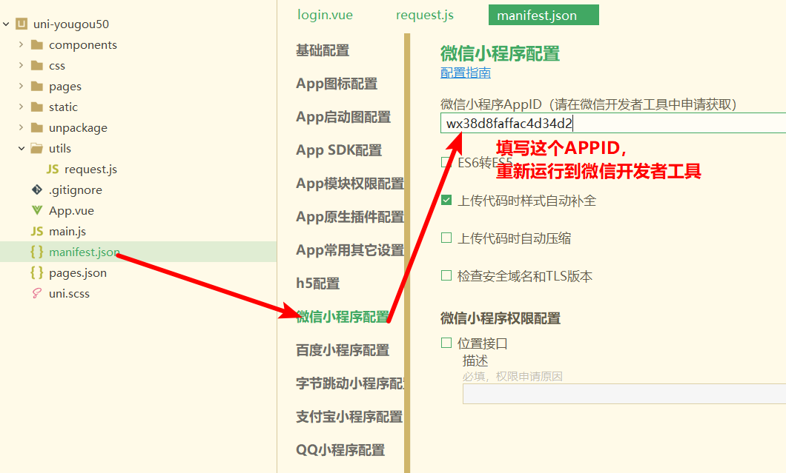
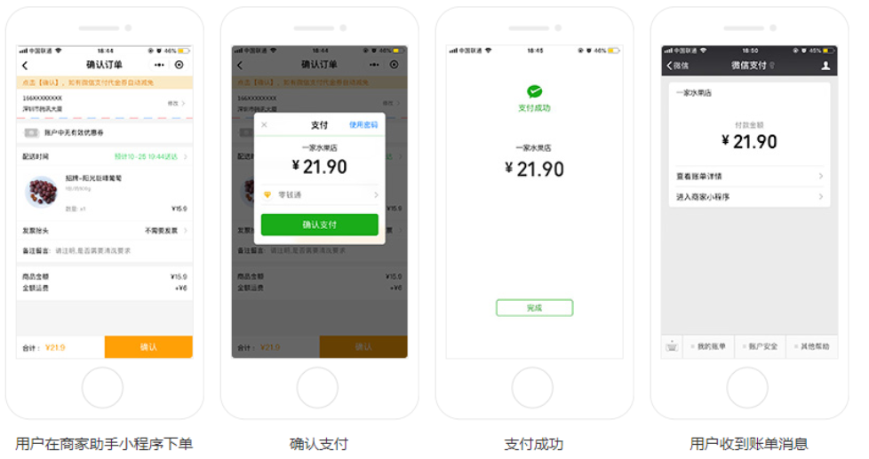
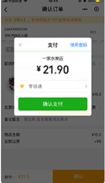
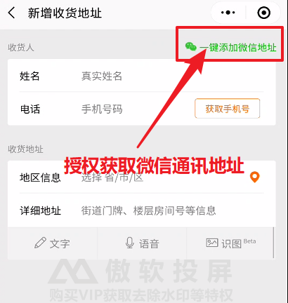

# day09

### 复习

补充：

+ 解决：打开页面时，搜索历史数据不存在的 bug
+ 解决：搜索关键字之后跳转到列表页面再回到时，联想列表依旧存在

搜索页面：

+ 点击搜索历史选项跳转到搜索列表页面
+ 清空历史搜索数据
  + `wx.showModel`

计算属性：

+ setter：给计算属性赋值时触发
+ getter：从计算属性中取值时触发

购物车：

+ 静态页面
+ 入口：在商品详情页面中点击购物车跳转到购物车页面

+ 获取数据的接口的分析：
  + 接口 & 方式
  + 参数：id 的集合
    + url?goods_id=100,110,130
  + 返回的数据：
    + 商品 id
    + 商品 名称
    + 商品 头像
    + 商品价格
  + 页面上需要的数据：
    + 商品 id
    + 商品名称
    + 商品头像
    + 商品价格
    + 商品数量
    + 商品状态
  + 结论：
    + 由于后端只返回了四条数据，我们在添加到购物车时，应该额外添加两个属性

数据的存储结构：

+ 数组
  + 有顺序
+ 对象
  + 取值方便

加入购物车：

+ 对象
+ 数组

优化处理

渲染页面上的数据：

+ 得到了所有的商品数据


### 今日内容

购物车：

+ 渲染数据
+ 操作数据

小程序的授权

小程序的登录

登录：

+ 完成静态页面
+ 完成登录

完成支付操作

+ 只有我才有资格付钱，你们没有


### 购物车-渲染选中状态及数量

> 接口返回的数组并不是按传参goodsId的顺序

+ 请求参数商品Id以逗号分隔

+ 取storage cart里面每一项的goodsId拼接

  + 推荐用map结合join

    ```js
    let goodsIdArr = this.storageCartArr.map(item=>{
        return item.goodsId
    })
    
    let idStr = goodsIdArr.join(',')
    ```

    

+ 发请求，返回数据

  + 尽早发请求在onShow，而且切换tab时，也可以刷新页面
  + 可以返回数据，但是数组并不是有序，所以无法在结构中遍历

+ storage cart 数据作为data属性，渲染

  + checkbox渲染，就是添加icon的样式

    ```js
    <text class="iconfont" :class="item.checked?'icon-checked':'icon-unchecked'"></text>
    ```


**注意点：**

+ find：从数组中的找到满足条的第一个元素
+ findIndex：从数组中的找到满足条的第一个元素的下标


### 购物车-渲染商品名称价格及图片

**问题：**

+ 商品名称如何渲染


**解决方案：**

+ 把storageCartArr和goodsList数据进行合并，合并以storageCartArr为主，因为它是有序的

  + storageGoods.goodsId去_goodsList里面找一项goods_id相等那一项, storageGoods和找到的对象进行合并成一个新的对象

  + 用map把合并到的对象返回作为新数组的每一项。

    ```js
    // storageCartArr和_goodsList合并,以storageCartArr为主
    this.goodsList = this.storageCartArr.map(storageGoods => {
        // storageGoods.goodsId去_goodsList里面找一项goods_id相等那一项, storageGoods和找到的对象进行合并成一个新的对象
        let targetGoods = _goodsList.find(item => {
            return item.goods_id === storageGoods.goodsId;
        });
        // 注意点,这里是对象
        return { ...storageGoods, ...targetGoods };
    });js
    ```

+ 用goodsList渲染页面


### 购物车-商品勾选与不勾选

+ 点击每一个商品时，item.checked取反


### 购物车-商品跳转商详

点击每个商品，跳转商详，并传参goodsId


### 购物车-商品数量 

+ 点击+时，数量++

+ 点击-时，数量--

+ 如果当前数量是1，再点击-时，弹框确认是否要删除，如果是的话，删除这一项

  

### 购物车-全选状态

+ 全选状态是由data.goodsList计算而来，所以应该是计算属性

+ 如何计算呢？
  + 勾选的商品数量===商品数量,为true
  + 有一个商品没有勾选，直接返回false;如果最终都没有返回false的话，那就返回true
  + 所有的商品都勾选，全选勾选,就返回true

    ```js
    return this.goodsList.every(item=>{
        return item.checked
    })
    ```

+ 注意点：
  + every会遍历原数组,对数组元素执行指定函数，如果所有的函数结果都为true的话，那么返回true
  + some会遍历原数组,对数组元素执行指定函数，如果有一个的函数结果都为true的话，那么返回true


### 购物车-全选点击

> 需求：点击全选时，如果全选选中的话，所有商品勾选; 如果全选去勾选的话，那么所有商品不勾选

**步骤：**

+ 点击全选时 @click="toggleAll", isAll取反

+ 在计算属性isAll里面添加set方法
  + set方法获取到this.isAll设置的值status，把status设置给所有的商品

    ```js
    // 所有的商品都勾选，全选勾选
    return this.goodsList.every(item => {
        return item.checked;
    });
    ```


### 购物车-总价与总数量

+ 总数量：所有勾选的商品数量之和

    ```js
    totalNum() {
        return this.goodsList.reduce((sum, item) => {
            return sum + (item.checked ? item.num : 0);
        }, 0);
    },
    ```

+ 总价格：所有勾选的商品数量*商品价格之和

    ```
    totalPrice() {
        return this.goodsList.reduce((sum, item) => {
            return sum + (item.checked ? item.num*item.goods_price : 0);
        }, 0);
    },
    ```


### watch - 使用补充

+ 如果侦听对象属性的改变，需要深度侦听`deep:true`

```js
watch: {
    // 侦听data属性，或者prop的改变，侦听属性作为方法名，方法形参就是改变的值
    //以下是简写
    // msg (newVal) {
    //   console.log(newVal)
    // },
    //完整写法.侦听属性作为watch里面属性名，改变属性触发handler
    msg:{
        handler(newVal){
            console.log(newVal)
        }
    },
        // 改变person的属性时，需要深度侦听
        person: {
            handler (newVal) {
                console.log(newVal)
            },
                deep:true,
                    // 第一次赋值就会触发handler
                    immediate:true
        }
}
```


### 购物车-状态存storage

> 购物车界面上有哪一些改变，需要更新到storage
>
> > 数量++
> >
> > 数量--
> >
> > 每一个商品勾选/不勾选
> >
> > 全选勾选/不勾选

**思路：**

+ 直接侦听goodsList的改变，goodsList更新到storage就可以了

**步骤：**

+ 深度侦听goodsList

+ goodsList包含了需要更新到storage里面所有的属性.无须取storage

+ 用goodsList构造一个storage cart，然后存回storage

```js
watch: {
    goodsList: {
        handler() {
            console.log(this.goodsList);
            //如何把goodsList更新到storage
            // goodsList包含了需要更新到storage里面所有的属性.无须取storage
            let cart = this.goodsList.map(item => {
                return {
                    goodsId: item.goodsId,
                    checked: item.checked,
                    num: item.num
                };
            });
            // 存cart到storage
            uni.setStorageSync(CART_KEY, cart);
        },
            // 深度侦听
            deep: true
    }
},
```

**注意点：**

+ 在购物车onHide里面goodsList=>storage不行。如果退出小程序，无法触发onHide


### 购物车 - 购物车中的数据存哪里

> 描述
>
> > 如果手机京东上，加入商品到购物车，在PC端打开京东网站，这个商品是否添加了？是的
> >
> > 如果京东网站，无没登录前加入购物车，再登录的话，这个商品是否在购物车？是的

+ 方案
  + 购物车据据存vuex：
    + 仅仅使用vuex不行，刷新就没有
  + 购物车数据存在storage：
    + 仅仅使用storage也不行

+ 购物车数据发请求

> 实际工作中，请求一般在100ms以内


### 复习 - Array的方法总结

1. find

   1. 概念：在数组里面找第一项符合条件的元素
   2. 如何作用的：遍历数组，对每一项执行指定函数，如果为ture，返回这一项，并中断遍历;如果一直没找到，返回undefined

2. findIndex

   1. 概念：在数组里面找第一项符合条件的元素的下标，如果没有找到的话，返回-1

3. forEach

   1. 遍历数组
   2. 注意点：
      1. 不能中断遍历，而且不能修改元素
         1. 可以改变元素的属性

4. map

   1. 概念：一般用来返回一个新的数组，新数组和原数组结构不一样
   2. 如何作用的：返回新数组，遍历原数组，每一项执行指定函数，返回值作为新数组的项

5. for...in 遍历数组或者对象

   1. for(let key in arr), key是指下标，而并不是元素本身
   
6. for ...of

   1. 遍历
   2. for(let item of arr), item是指元素并不是指下标。遍历可以中断

7. every

   1. 遍历数组，每一项执行指定函数，**所有**结果为true,就返回true

8. some

   1. 遍历数组，每一项执行指定函数，**只要有一项**结果为true,就返回true

9. reduce

   1. 如何作用
      1. 中间变量的初始值为第2个参数
      2. 中间变量和元素的计算结果都会赋值给中间变量
      3. 遍历结束后，reduce返回中间变量
   2. 应用场景：累加和阶乘

   ```js
   数组.reduce((中间变量,元素)=>{
   	return 中间变量和元素的计算
   },中间变量的初始值)
   
   let arr2 =[1,2,3,4,5]
   let jiecheng = arr2.reduce((yinzi,item)=>{
     console.log(yinzi,item)
     return yinzi*item
   },1)
   ```


### 补充 - 解决页面打开时没有数据的 bug

**表现：**

+ 打开购物车之后，一直加载，没有数据

**原因：**

+ 打开购物车时， storage 中没有数据，没有商品的 id,将来传到服务器中的 id 为空，结果出现了问题

**解决方案：**

+ 在发送请求之前，判断：
  + 如果 id 存在，就发送请求
  + 如果不存在，就不发送


### 补充 - 解决添加完数据到购物车不显示的 bug

**表现：**

+ 数据已经被添加到购物车中了，但是切换到购物车页面无法显示

**原因：**

+ 因为第一次打开购物车时，是没有数据的，但是购物车页面会保存保存到页面栈中
+ 切换到详情页面添加数据到 storage 中之后，再重新切换回购物车，购物车中的数据并不会更新
+ 因为我们请求数据的方法写在 onload 中

**解决方案：**

+ 将得到数据的代码写到 `onShow` 方法中


### 小程序 - 授权

> 文档位置: 指南->开放能力->授权 [传送门](https://developers.weixin.qq.com/miniprogram/dev/framework/open-ability/authorize.html)

**作用：**

+ 小程序向微信要一些权限，微信运动步数，摄像头，录音，通讯地址。。。

**基本使用（不包括用户信息）**

+ 发起授权

+ 调用授权接口

```js
 	// 1. 发起授权，弹出授权弹框
    wx.authorize({
      scope: 'scope.address',
      success:res=>{
        //如果用户允许会进入success（第一次授权允许或者授权允许后再点击也会进来）
        //调用相应的API接口
        wx.chooseAddress({
          success: (result) => {
            console.log(result)
          }
        })
      }
    })
```

**用户信息授权:**

```html
<button open-type="getUserInfo" bindgetuserinfo="事件处理方法">获取用户信息</button>
```

```js
Page({
	事件处理方法(event){
        event.detail 获取到用户信息
    }
})
```

> 微信小程序官方规定只能通过button声明式的方式来获取用户信息，只能点击button才可以获取，避免获取用户信息API滥用。

**注意点：**

1. 发起授权，第一次会弹框，如果允许了，下次点击不会再弹了。

2. 微信开发者工具，工具栏清缓存下拉，找到清除授权数据，可以清除掉授权缓存

3. 微信开发者工具，授权弹框是在屏幕中央，预览手机扫码授权弹框就是在底部

4. 授权弹框的样式是微信小程序规定的，改不了。

5. 在手机端微信小程序授权缓存，小程序从最近使用删除掉

6. 小程序授权获取通讯地址，来自于微信->头像->我的地址，就可以找到。

7. 如果授权获取通讯地址，需要在app.json里面配置`permission`

   ```json
   {
   	pages:[],
       "permission": {
       "scope.userLocation": {
         "desc": "你的位置信息将用于小程序位置接口的效果展示"
       }
     }
   }
   ```

8. 用户信息授权，如果拒绝了，下次再点击，也会弹。除了用户信息授权之外的其他授权，如果拒绝，下次再点击没反应，实际工作中如何处理拒绝呢？TODO


### 小程序 - 登录

> 文档的位置：指南->开放能力->小程序登录 [传送门](https://developers.weixin.qq.com/miniprogram/dev/framework/open-ability/login.html)

**概念**

+ 用微信账号登陆小程序

**原理**

> 本质上还是一个第三方登录



**注意点**

+ AppSecret是小程序密钥，每次小程序后台重置都会重新生成
+ 实际项目里面，小程序登录请求，不仅仅需要code，而且需要传递用户信息（授权）


### 登录-跳转到登录页面

> 由于将来登录成功之后服务器会返回一个 token，我们会将 token 保存到 storage 中

**如何判断用户是否登录：**

+ 只需要判断 storage 中是否存在 token 就可以

+ 如果存在：
  + 直接结算
+ 如果不存在：
  + 跳转到登录页面


### 登录-页面分析与静态页面


1. 入口：当我们访问一个页面，需要登录态时候，就会跳转到登录页
2. 主要模块
   1. 点我登录的授权登录的按钮
3. 其他说明
   1. 小程序授权+小程序登陆


### 登录-微信授权登录

**接口信息：**

+ 接口：url  https://www.uinav.com/api/public/v1/users/wxlogin 

+ 方法：post

+ 参数
  + code 是通过wx.login获取
  + 用户信息参数：通过用户信息授权获取

```html
<button open-type="getUserInfo"></button>
```

**步骤：**

+ 先获取code
+ 再获取用户信息
+ 调登录接口获取token
  + 需要得到后端的 appid
  + 将 token 保存到 storage 中
  + 回退到购物车页面

**注意点：**

+ 注意这个登录请求是方法是post，确认request.js有传递method

+ 如果登陆接口返回以下信息，就需要配置。也表示你的请求参数基本是对的




### 登录-微信授权登录需要配置

**为什么需要配置？**

+ 如果要正常使用所有的功能，微信账号必须是小程序的项目成员

+ 涉及商城而且有支付功能，必须不能是 个人小程序账号，所以只能用广州小程序id
  + 需要企业营业执照

+ 服务器地址也只能用广州的


**需要配置什么？**

+ 服务器地址https://www.uinav.com或者https://api-ugo-dev.itheima.net

+ appid换成 `wxfb52f2d7b2f6123a`

+ 需要老师扫码微信开发者工具


**步骤（登录前一定要做的）：**

+ 公共请求里面BASE_URL需要 https://www.uinav.com或者https://api-ugo-dev.itheima.net

+ 在微信开发者工具里面退出你的账号



+ 修改appid



+ 让老师扫码登录微信开发者工具

**注意点**

+ 微信开发者工具同一时间只能登录一个账号，需要排队的。

+ 让老师扫码之前，保证登录请求OK，请求参数OK
  + url
  + method
  + 参数


### 小程序 - 微信支付（了解）

> 用户在微信小程序内唤起微信支付，完成支付返回微信小程序 [传送门](https://pay.weixin.qq.com/static/product/product_intro.shtml?name=miniapp)

**使用示例**



**申请流程**

+ 申请小程序开发者账号，而且必须是**小程序企业开发者账号**
  + 企业开发者账号需要营业执照

  + 公司里面有营业执照

+ 微信认证
  + 个人号无法认证

+ 小程序开通微信支付

+ 点击开通按钮后，**选择新申请微信支付商户号或绑定一个已有的微信支付商户号**，

+ 申请微信支付商户号
  + [传送门](https://pay.weixin.qq.com/index.php/apply/applyment_home/guide_normal)
  + 需要营业执照和银行卡号

+ 业务流程
  + 前端只调接口，拿到支付参数，然后调用wx.requestPayment，唤起微信支付



```js
wx.requestPayment({
  timeStamp: '',
  nonceStr: '',
  package: '',
  signType: 'MD5',
  paySign: '',
  success (res) { },
  fail (res) { }
})
```

+ 后端调用`wxsdk.reqWXUnifiedorder`,传入appid，商户号，open_id等生成前端微信支付的参数。

```
 wxsdk.reqWXUnifiedorder(wxconfig.AppID, wxconfig.MchId, wxconfig.PayKey, user.wx_open_id.toString(), out_trade_no, 1, "品优购支付", wxconfig.wxPayNotifiyUrl)
```


### 小程序授权拒绝处理

[授权](https://developers.weixin.qq.com/miniprogram/dev/framework/open-ability/authorize.html)

在`wx.authorize`的fail方法里面，弹框提示用户打开授权设置。如果用户在设置里面允许相应的授权的话，下次点击后，就可以调相应的接口获取数据

1. `wx.authorize`的fail方法，无论是第一次拒绝还是拒绝后再点击都会进入fail

```js
    // 1. 发起授权，弹出授权弹框
    wx.authorize({
      scope: 'scope.address',
      success:res=>{
        console.log('进入success')
        //如果用户允许会进入success（第一次授权允许或者授权允许后再点击也会进来）
        //调用相应的API接口
        wx.chooseAddress({
          success: (result) => {
            console.log(result)
          },
        })
      },
      fail(){
        //无论第一次拒绝还是后续拒绝都会进入fail
        wx.showModal({
          content: '请在打开的设置中允许通讯址',
          title: '提示',
          success: (result) => {
            if(result.confirm){
              //打开授权设置。是界面
              wx.openSetting()
            }
          }
        })
      }
    })
```


**注意点：**

+ `wx.getSetting`是用来获取所有授权信息数据，`wx.openSetting()`可以打开授权设置查看所有的授权状态，是前者的界面版本。


### 支付-页面分析&静态页面

+ 入口：购物车页页面点击结算跳转到支付页面。还有商详立即购买也会跳转到支付页面

+ 主要模块
  + 收货地址
  + 商品列表
  + 微信支付，会显示总价格

+ 其他说明
  + 购物车中选中的商品才会展示在支付页面上
  + 商品列表每个商品不支持勾选/去勾选，不能调整数量

### 支付-授权获取收货地址

+ 实际项目，一般会有后台接口提供收货地址的增删改查，同时可以获取微信授权通讯地址，比如小米Lite小程序



+ 点击"请选择地址"，授权获取通讯地址

+ 获取到授权通讯地址后，作为data属性，渲染

+ 重启小程序后，授权获取地址丢失
  + 存在storage, key :addr

  